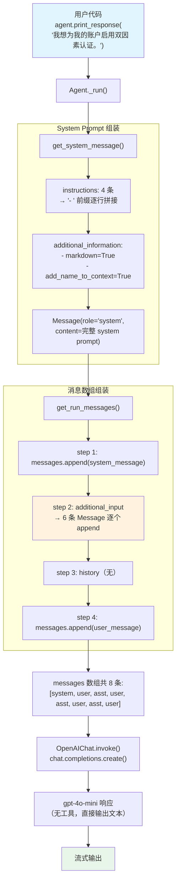

# few_shot_learning.py — 实现原理分析

> 源文件：`02_agents/context_management/few_shot_learning.py`

## 概述

本示例展示 Agno 的 **`additional_input`（少样本学习）** 机制：通过预定义一组 user/assistant 对话示例，在每次运行时插入到 system prompt 之后、用户输入之前，让 LLM 学习期望的回复模式和风格。本例为客户支持场景构建了 3 组示例（密码重置、账单问题、应用崩溃），引导 LLM 以结构化、有同理心的方式回复。

**核心配置一览：**

| 配置项 | 值 | 说明 |
|--------|------|------|
| `name` | `"客户支持专员"` | Agent 名称 |
| `model` | `OpenAIChat(id="gpt-4o-mini")` | **Chat Completions API** |
| `add_name_to_context` | `True` | 在 system prompt 注入 `"Your name is: 客户支持专员."` |
| `additional_input` | 6 条 `Message`（3 组 user/assistant 对） | 少样本示例 |
| `instructions` | 4 条指令列表 | 专业支持指令 |
| `markdown` | `True` | 注入 `"Use markdown to format your answers."` |
| `tools` | 无 | 无工具 |

---

## 架构分层

```
用户代码层                agno.agent 层
┌──────────────────┐    ┌──────────────────────────────────┐
│ few_shot_        │    │ Agent._run()                     │
│ learning.py      │    │  ├ _messages.py                  │
│                  │    │  │  get_system_message()          │
│ additional_input │───>│  │    → system prompt (4 指令     │
│  = [             │    │  │       + markdown + name)       │
│    user, asst,   │    │  │                                │
│    user, asst,   │    │  │  get_run_messages()            │
│    user, asst    │    │  │    step 1: system_message      │
│  ]               │    │  │    step 2: additional_input    │
│                  │    │  │      → 6 条 Message 插入       │
│                  │    │  │    step 3: history (无)         │
│                  │    │  │    step 4: user_message         │
└──────────────────┘    └──────────────────────────────────┘
                                │
                        ┌───────┴──────────┐
                        ▼
                ┌──────────────┐
                │ OpenAIChat   │
                │ gpt-4o-mini  │
                └──────────────┘
```

---

## 核心组件解析

### additional_input 注入流程

`additional_input` 在 `get_run_messages()`（`_messages.py:1204-1228`）中处理，位于 system message 之后、history 之前：

```python
# get_run_messages() 中的消息组装顺序：
# 1. system_message → messages[0]
# 2. additional_input → messages[1..6]（少样本示例）
# 3. history（本例无）
# 4. user_message → messages[7]（当前用户输入）

if agent.additional_input is not None:
    for _m in agent.additional_input:
        if isinstance(_m, Message):               # ← 本例命中
            run_messages.messages.append(_m)       # 直接追加到消息列表
            run_messages.extra_messages.append(_m)
        elif isinstance(_m, dict):
            _m_parsed = Message.model_validate(_m) # 字典 → Message
            run_messages.messages.append(_m_parsed)
```

这些消息直接作为 messages 数组的一部分发送给 LLM，实现少样本学习（few-shot learning）。

### 少样本示例结构

```
Message(role="user",      content="我忘记密码了，无法登录")
Message(role="assistant",  content="我会立即帮你重置密码。\n\n**重置密码的步骤:**\n...")
Message(role="user",      content="我被重复收费两次同一笔订单，我很沮丧！")
Message(role="assistant",  content="对于账单错误以及给你造成的困扰，我深表歉意。\n...")
Message(role="user",      content="当我尝试上传照片时，你们的应用一直崩溃")
Message(role="assistant",  content="很抱歉你在上传照片时遇到崩溃问题。\n...")
```

示例展示了 3 种支持模式：
1. **密码重置** → 清晰步骤 + 超时提示
2. **账单问题** → 道歉 + 行动计划 + 补偿
3. **技术问题** → 分级故障排除 + 升级路径

### add_name_to_context

`add_name_to_context=True` 在 `get_system_message()` 的 additional_information 段中注入：

```python
# _messages.py:224-225
if agent.name is not None and agent.add_name_to_context:
    additional_information.append(f"Your name is: {agent.name}.")
    # → "Your name is: 客户支持专员."
```

### markdown=True

在 `get_system_message()` 的 additional_information 段中注入（仅在无 output_model 时）：

```python
# _messages.py:184-185
if agent.markdown and output_schema is None:
    additional_information.append("Use markdown to format your answers.")
```

---

## System Prompt 组装

| 序号 | 组成部分 | 本文件中的值/来源 | 是否生效 |
|------|---------|-----------------|---------|
| 1 | `description` | `None` | 否 |
| 2 | `role` | `None` | 否 |
| 3 | `instructions` | 4 条列表 | 生效（`"- "` 前缀拼接） |
| 4.1 | `markdown` | `True` | 生效 |
| 4.2 | `add_datetime_to_context` | `False` | 否 |
| 4.3 | `add_location_to_context` | `False` | 否 |
| 4.4 | `add_name_to_context` | `True`，name=`"客户支持专员"` | 生效 |
| 5-12 | 其余段落 | 均为空/关闭 | 否 |

### 最终 System Prompt

```text
- 你是一名专业的客户支持专员。
- 始终保持同理心、专业性和解决方案导向。
- 提供清晰、可操作的步骤来解决客户问题。
- 遵循既定模式，以实现一致的高质量支持。
<additional_information>
- Use markdown to format your answers.
- Your name is: 客户支持专员.
</additional_information>
```

> 4 条 instructions 以 `"- "` 前缀逐行拼接；`additional_information` 用 `<additional_information>` 标签包裹。

---

## 完整 API 请求

```python
client.chat.completions.create(
    model="gpt-4o-mini",
    messages=[
        # 1. System Message
        {
            "role": "developer",
            "content": "- 你是一名专业的客户支持专员。\n- 始终保持同理心、专业性和解决方案导向。\n- 提供清晰、可操作的步骤来解决客户问题。\n- 遵循既定模式，以实现一致的高质量支持。\n<additional_information>\n- Use markdown to format your answers.\n- Your name is: 客户支持专员.\n</additional_information>\n\n"
        },
        # 2. Additional Input（少样本示例 × 3 组）
        {"role": "user", "content": "我忘记密码了，无法登录"},
        {"role": "assistant", "content": "我会立即帮你重置密码。\n\n**重置密码的步骤:**\n1. 进入登录页面并点击\"忘记密码\"\n2. 输入你的电子邮件地址\n3. 检查你的电子邮件以获取重置链接\n4. 点击链接创建新密码\n5. 使用包含大写、小写、数字和符号的强密码\n\n如果你在 5 分钟内没有收到电子邮件，请检查你的垃圾邮件文件夹。如果你在这些步骤中需要任何帮助，请告诉我！"},
        {"role": "user", "content": "我被重复收费两次同一笔订单，我很沮丧！"},
        {"role": "assistant", "content": "对于账单错误以及给你造成的困扰，我深表歉意。\n\n**即时行动计划:**\n1. 我会调查你的账户以确认重复收费\n2. 处理重复交易的全额退款\n3. 通过检查你的付款方式设置来确保这不会再次发生\n4. 在退款处理完成后向你提供确认号\n\n退款通常需要 3-5 个工作日才能出现在你的账单上。作为对此不便的歉意，我还想为你提供下次订单 10% 的折扣。\n\n关于这个问题，我还能帮你做什么吗？"},
        {"role": "user", "content": "当我尝试上传照片时，你们的应用一直崩溃"},
        {"role": "assistant", "content": "很抱歉你在上传照片时遇到崩溃问题。让我帮你解决这个问题。\n\n**故障排除步骤:**\n1. **检查应用版本:** 确保你从应用商店安装了最新版本\n2. **重启应用:** 完全关闭并重新打开应用程序\n...(完整内容)"},
        # 3. 当前用户输入
        {"role": "user", "content": "我想为我的账户启用双因素认证。"}
    ],
    stream=True,
    stream_options={"include_usage": True}
)
```

> 关键：少样本示例作为 messages 数组中的 user/assistant 对话轮次插入，位于 system 之后、当前 user 之前。LLM 会将这些示例视为"之前的对话"，从而学习回复模式。

---

## Mermaid 流程图



---

## 关键源码文件索引

| 文件 | 关键函数/类 | 作用 |
|------|------------|------|
| `agno/agent/agent.py` | `additional_input` L261 | Agent 属性：少样本示例列表 |
| `agno/agent/_messages.py` | `get_run_messages()` L1204-1228 | 将 additional_input 追加到 messages 数组 |
| `agno/agent/_messages.py` | `get_system_message()` L184-185 | `markdown=True` → additional_information |
| `agno/agent/_messages.py` | `get_system_message()` L224-225 | `add_name_to_context` → additional_information |
| `agno/agent/_messages.py` | `get_system_message()` L246-248 | instructions 列表拼接（`"- "` 前缀） |
| `agno/agent/_messages.py` | `get_system_message()` L252-256 | additional_information 用标签包裹 |
| `agno/models/openai/chat.py` | `OpenAIChat` | Chat Completions API（role: developer） |
