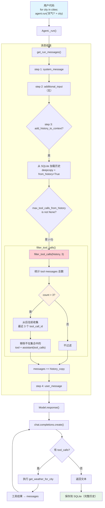

# filter_tool_calls_from_history.py — 实现原理分析

> 源文件：`02_agents/context_management/filter_tool_calls_from_history.py`

## 概述

本示例展示 Agno 的 **`max_tool_calls_from_history`（历史工具调用过滤）** 机制：在启用 `add_history_to_context=True` 的多轮对话中，历史消息可能积累大量工具调用（assistant 的 tool_calls + tool result messages），导致 token 成本急剧增长。`max_tool_calls_from_history=3` 限制上下文中仅保留历史中最近 3 次工具调用，过滤掉更早的工具相关消息。**关键点**：过滤仅影响发送给模型的上下文，数据库中仍保留完整历史。

**核心配置一览：**

| 配置项 | 值 | 说明 |
|--------|------|------|
| `model` | `OpenAIChat(id="gpt-4o-mini")` | Chat Completions API |
| `tools` | `[get_weather_for_city]` | 裸函数，自动转换为 Function |
| `instructions` | `"你是一个天气助手。使用 get_weather_for_city 工具获取天气。"` | 单条指令 |
| `max_tool_calls_from_history` | `3` | 历史中最多保留 3 次工具调用 |
| `db` | `SqliteDb(db_file="tmp/weather_data.db")` | SQLite 存储 |
| `add_history_to_context` | `True` | 启用历史回放 |
| `markdown` | `True` | 注入 markdown 指令 |

---

## 架构分层

```
用户代码层                agno.agent 层                  agno.utils 层
┌──────────────────┐    ┌───────────────────────┐    ┌──────────────────────┐
│ filter_tool_     │    │ Agent._run()          │    │ message.py           │
│ calls_from_      │    │                       │    │                      │
│ history.py       │    │ _messages.py          │    │ filter_tool_calls()  │
│                  │    │  get_run_messages()    │    │  保留最近 N 次工具调 │
│ max_tool_calls_  │───>│   step 3: history     │───>│  用，移除更早的      │
│ from_history=3   │    │     filter_tool_calls  │    │  tool + assistant    │
│                  │    │     (history, 3)       │    │  (tool_calls) 消息   │
│ add_history_to_  │    │                       │    │                      │
│ context=True     │    │   step 4: user_msg    │    │                      │
└──────────────────┘    └───────────────────────┘    └──────────────────────┘
                                │
                        ┌───────┴──────────┐
                        ▼                  ▼
                ┌──────────────┐    ┌──────────────┐
                │ OpenAIChat   │    │ SqliteDb     │
                │ gpt-4o-mini  │    │ (完整历史)   │
                └──────────────┘    └──────────────┘
```

---

## 核心组件解析

### filter_tool_calls 算法

`filter_tool_calls()`（`agno/utils/message.py:10-59`）的核心逻辑：

```python
def filter_tool_calls(messages: List[Message], max_tool_calls: int) -> None:
    """原地过滤消息，仅保留最近 N 次工具调用。"""

    # 1. 统计 tool message 总数
    tool_call_count = sum(1 for m in messages if m.role == "tool")
    if tool_call_count <= max_tool_calls:
        return  # 不需要过滤

    # 2. 从后往前收集要保留的 tool_call_id（最近 N 个）
    tool_call_ids_to_keep = set()
    for msg in reversed(messages):
        if msg.role == "tool" and len(tool_call_ids_to_keep) < max_tool_calls:
            tool_call_ids_to_keep.add(msg.tool_call_id)

    # 3. 过滤消息（原地修改）
    filtered_messages = []
    for msg in messages:
        if msg.role == "tool":
            # 仅保留在窗口内的 tool result
            if msg.tool_call_id in tool_call_ids_to_keep:
                filtered_messages.append(msg)
        elif msg.role == "assistant" and msg.tool_calls:
            # 过滤 assistant 消息中的 tool_calls 列表
            filtered_msg = deepcopy(msg)
            filtered_msg.tool_calls = [
                tc for tc in filtered_msg.tool_calls
                if tc.get("id") in tool_call_ids_to_keep
            ]
            if filtered_msg.tool_calls:
                filtered_messages.append(filtered_msg)
            elif filtered_msg.content:
                # 有文本内容但无保留的 tool_calls → 保留文本
                filtered_msg.tool_calls = None
                filtered_messages.append(filtered_msg)
        else:
            # user 和其他消息保持不变
            filtered_messages.append(msg)

    messages[:] = filtered_messages  # 原地替换
```

### 过滤在历史加载时执行

过滤发生在 `get_run_messages()` 的 step 3（历史回放），**仅对 history 副本操作**：

```python
# _messages.py:1248-1262
if len(history) > 0:
    history_copy = [deepcopy(msg) for msg in history]   # 深拷贝
    for _msg in history_copy:
        _msg.from_history = True                        # 标记为历史消息

    # 在此处过滤（对副本操作，不影响数据库）
    if agent.max_tool_calls_from_history is not None:
        filter_tool_calls(history_copy, agent.max_tool_calls_from_history)

    run_messages.messages += history_copy                # 追加到 messages
```

关键：`deepcopy` 确保数据库中的原始历史不被修改。

### 运行间的上下文变化

以 8 个城市依次查询为例（每次查询产生 1 次工具调用）：

| 运行 | 城市 | DB 中工具调用 | 历史中工具调用 | 过滤后上下文中 | 当前工具调用 | 总计上下文中 |
|------|------|-------------|--------------|--------------|------------|------------|
| 1 | Tokyo | 1 | 0 | 0 | 1 | 1 |
| 2 | Delhi | 2 | 1 | 1 | 1 | 2 |
| 3 | Shanghai | 3 | 2 | 2 | 1 | 3 |
| 4 | São Paulo | 4 | 3 | **3** | 1 | **4** |
| 5 | Mumbai | 5 | 4→**3** | **3** | 1 | **4** |
| 6 | Beijing | 6 | 5→**3** | **3** | 1 | **4** |
| 7 | Cairo | 7 | 6→**3** | **3** | 1 | **4** |
| 8 | London | 8 | 7→**3** | **3** | 1 | **4** |

从运行 5 开始，历史中的工具调用被截断为 3 个（最近的），上下文中的总工具调用数稳定在 4（3 历史 + 1 当前）。

### get_weather_for_city 工具

```python
def get_weather_for_city(city: str) -> str:
    conditions = ["Sunny", "Cloudy", "Rainy", "Snowy", "Foggy", "Windy"]
    temperature = random.randint(-10, 35)
    condition = random.choice(conditions)
    return f"{city}: {temperature}°C, {condition}"
```

裸函数，通过 `Function.from_callable()` 自动转换。`process_entrypoint()` 生成的 JSON Schema：

```json
{
    "name": "get_weather_for_city",
    "parameters": {
        "type": "object",
        "properties": {
            "city": {"type": "string"}
        },
        "required": ["city"]
    }
}
```

> 无 docstring → description 为空或从函数名推导。

---

## System Prompt 组装

| 序号 | 组成部分 | 本文件中的值/来源 | 是否生效 |
|------|---------|-----------------|---------|
| 1 | `description` | `None` | 否 |
| 2 | `role` | `None` | 否 |
| 3 | `instructions` | `"你是一个天气助手。使用 get_weather_for_city 工具获取天气。"` | 生效（单条） |
| 4.1 | `markdown` | `True` | 生效 |
| 4.2-4.4 | 其余 additional_information | 默认关闭 | 否 |
| 5-12 | 其余段落 | 均为空/关闭 | 否 |

### 最终 System Prompt

```text
你是一个天气助手。使用 get_weather_for_city 工具获取天气。

<additional_information>
- Use markdown to format your answers.
</additional_information>
```

---

## 完整 API 请求

### 第 1 次运行（无历史）

```python
client.chat.completions.create(
    model="gpt-4o-mini",
    messages=[
        {
            "role": "developer",
            "content": "你是一个天气助手。使用 get_weather_for_city 工具获取天气。\n\n<additional_information>\n- Use markdown to format your answers.\n</additional_information>\n\n"
        },
        {
            "role": "user",
            "content": "What's the weather in Tokyo?"
        }
    ],
    tools=[
        {
            "type": "function",
            "function": {
                "name": "get_weather_for_city",
                "parameters": {
                    "type": "object",
                    "properties": {
                        "city": {"type": "string"}
                    },
                    "required": ["city"]
                }
            }
        }
    ],
    stream=False
)
```

### 第 6 次运行（历史被过滤）

```python
client.chat.completions.create(
    model="gpt-4o-mini",
    messages=[
        {"role": "developer", "content": "...system prompt..."},
        # --- 过滤后的历史（仅保留最近 3 次工具调用）---
        # 第 3 次运行的对话（Shanghai）被过滤掉
        # 第 4 次运行的对话（São Paulo）→ 保留
        {"role": "user", "content": "What's the weather in São Paulo?"},
        {"role": "assistant", "content": null, "tool_calls": [{"id": "call_4", "function": {"name": "get_weather_for_city", "arguments": "{\"city\": \"São Paulo\"}"}}]},
        {"role": "tool", "tool_call_id": "call_4", "content": "São Paulo: 28°C, Sunny"},
        {"role": "assistant", "content": "...São Paulo 天气回复..."},
        # 第 5 次运行（Mumbai）→ 保留
        {"role": "user", "content": "What's the weather in Mumbai?"},
        {"role": "assistant", "content": null, "tool_calls": [{"id": "call_5", ...}]},
        {"role": "tool", "tool_call_id": "call_5", "content": "Mumbai: 32°C, Cloudy"},
        {"role": "assistant", "content": "...Mumbai 天气回复..."},
        # --- 以上最近 3 次工具调用（省略第 3 次以节省空间）---
        # --- 当前用户输入 ---
        {"role": "user", "content": "What's the weather in Beijing?"}
    ],
    tools=[...],
    stream=False
)
```

---

## 多轮交互流程

```
运行 1 (Tokyo):
  messages = [system, user] → LLM → tool_call → tool_result → LLM → text
  DB: 保存 1 次工具调用

运行 2 (Delhi):
  messages = [system, history(Tokyo: 1 tool), user] → ...
  DB: 保存 2 次工具调用

运行 3 (Shanghai):
  messages = [system, history(Tokyo+Delhi: 2 tools), user] → ...
  DB: 保存 3 次工具调用

运行 4 (São Paulo):
  messages = [system, history(3 tools, 不需要过滤), user] → ...
  DB: 保存 4 次工具调用

运行 5 (Mumbai):                    ← 首次触发过滤
  history = 4 次工具调用
  filter_tool_calls(history, 3)     ← 移除最早的 1 次（Tokyo）
  messages = [system, history(3 tools), user] → ...
  DB: 保存 5 次工具调用（完整）

运行 8 (London):
  history = 7 次工具调用
  filter_tool_calls(history, 3)     ← 移除最早的 4 次
  messages = [system, history(3 tools), user] → ...
  DB: 保存 8 次工具调用（完整）
```

---

## 过滤前后对比

```
过滤前（运行 6，历史中 5 次工具调用）      过滤后（保留最近 3 次）
┌────────────────────────────────┐     ┌────────────────────────────────┐
│ [system]                       │     │ [system]                       │
│ [user: Tokyo]           ←删除  │     │                                │
│ [asst: tool_call_1]    ←删除  │     │                                │
│ [tool: Tokyo result]   ←删除  │     │                                │
│ [asst: Tokyo reply]           │     │ [asst: Tokyo reply] (无工具)   │
│ [user: Delhi]          ←删除  │     │                                │
│ [asst: tool_call_2]    ←删除  │     │                                │
│ [tool: Delhi result]   ←删除  │     │                                │
│ [asst: Delhi reply]           │     │ [asst: Delhi reply] (无工具)   │
│ [user: Shanghai]              │     │ [user: Shanghai]               │
│ [asst: tool_call_3]          │     │ [asst: tool_call_3]  ←保留    │
│ [tool: Shanghai result]      │     │ [tool: Shanghai result] ←保留 │
│ [asst: Shanghai reply]       │     │ [asst: Shanghai reply]         │
│ [user: São Paulo]            │     │ [user: São Paulo]              │
│ [asst: tool_call_4]         │     │ [asst: tool_call_4]  ←保留    │
│ [tool: São Paulo result]    │     │ [tool: São Paulo result] ←保留│
│ [asst: São Paulo reply]     │     │ [asst: São Paulo reply]        │
│ [user: Mumbai]               │     │ [user: Mumbai]                 │
│ [asst: tool_call_5]         │     │ [asst: tool_call_5]  ←保留    │
│ [tool: Mumbai result]       │     │ [tool: Mumbai result] ←保留   │
│ [asst: Mumbai reply]        │     │ [asst: Mumbai reply]           │
│                              │     │                                │
│ [user: Beijing]              │     │ [user: Beijing]                │
└────────────────────────────────┘     └────────────────────────────────┘

   上下文 token: ~大                     上下文 token: ~中等（稳定）
   DB 中: 完整保留 5 次工具调用            DB 中: 同样完整保留
```

---

## Mermaid 流程图



---

## 关键源码文件索引

| 文件 | 关键函数/类 | 作用 |
|------|------------|------|
| `agno/utils/message.py` | `filter_tool_calls()` L10 | 核心过滤算法（保留最近 N 次工具调用） |
| `agno/agent/_messages.py` | `get_run_messages()` L1257-1258 | 在历史加载后、追加前调用过滤 |
| `agno/agent/_messages.py` | `get_run_messages()` L1241-1246 | 从 SQLite 加载历史消息 |
| `agno/agent/agent.py` | `max_tool_calls_from_history` L133 | Agent 属性定义 |
| `agno/agent/agent.py` | `add_history_to_context` | 启用历史回放 |
| `agno/tools/function.py` | `Function.from_callable()` L219 | 裸函数 → Function + JSON Schema |
| `agno/models/openai/chat.py` | `OpenAIChat` | Chat Completions API |
| `agno/db/sqlite.py` | `SqliteDb` | 会话存储（完整历史不受过滤影响） |
