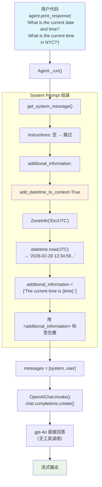

# instructions.py — 实现原理分析

> 源文件：`02_agents/context_management/instructions.py`

## 概述

本示例展示 Agno 的 **`add_datetime_to_context`** 机制：一个极简 Agent，仅设置模型和时间注入，不设置 instructions/description/role/tools。通过 `add_datetime_to_context=True` 和 `timezone_identifier="Etc/UTC"` 将当前 UTC 时间动态注入到 system prompt 的 `<additional_information>` 段中，使 LLM 能够回答时间相关问题。

**核心配置一览：**

| 配置项 | 值 | 说明 |
|--------|------|------|
| `model` | `OpenAIChat(id="gpt-4o")` | Chat Completions API |
| `add_datetime_to_context` | `True` | 注入当前时间到 system prompt |
| `timezone_identifier` | `"Etc/UTC"` | 使用 UTC 时区 |
| `instructions` | `None` | 未设置 |
| `description` | `None` | 未设置 |
| `tools` | `None` | 无工具 |

---

## 架构分层

```
用户代码层                agno.agent 层
┌──────────────────┐    ┌──────────────────────────────────┐
│ instructions.py  │    │ Agent._run()                     │
│                  │    │  ├ _messages.py                  │
│ add_datetime_to_ │───>│  │  get_system_message()          │
│ context=True     │    │  │    → additional_information:  │
│ timezone=UTC     │    │  │      "The current time is     │
│                  │    │  │       {datetime.now(UTC)}."    │
│ 无 instructions  │    │  │                                │
│ 无 tools         │    │  │  get_run_messages()            │
│                  │    │  │    [system, user]              │
└──────────────────┘    └──────────────────────────────────┘
                                │
                                ▼
                        ┌──────────────┐
                        │ OpenAIChat   │
                        │ gpt-4o       │
                        └──────────────┘
```

---

## 核心组件解析

### add_datetime_to_context 注入

在 `get_system_message()`（`_messages.py:187-202`）中处理：

```python
# 3.2.2 Add the current datetime
if agent.add_datetime_to_context:
    from datetime import datetime

    tz = None

    if agent.timezone_identifier:          # "Etc/UTC"
        try:
            from zoneinfo import ZoneInfo
            tz = ZoneInfo(agent.timezone_identifier)  # ZoneInfo("Etc/UTC")
        except Exception:
            log_warning("Invalid timezone identifier")

    time = datetime.now(tz) if tz else datetime.now()
    additional_information.append(f"The current time is {time}.")
    # → "The current time is 2026-02-28 12:34:56.789012+00:00."
```

### 极简 Agent 的 System Prompt

本例没有设置 `description`、`role`、`instructions`、`markdown`、`add_name_to_context` 等，唯一生效的组件是 `add_datetime_to_context`。

拼接流程：
1. `description` → None → 跳过
2. `role` → None → 跳过
3. `instructions` → 空列表 → 跳过
4. `additional_information` → `["The current time is {time}."]` → 1 条 → 生效

由于只有 `additional_information` 有内容，system_message_content 仅包含时间信息，被 `<additional_information>` 标签包裹。

### 无 instructions 时的拼接行为

与完全空 Agent（无任何配置）不同，本例因为 `add_datetime_to_context=True`，`system_message_content` 不为空，`get_system_message()` 返回有效的 `Message` 对象。

对比：

| 场景 | system_message_content | get_system_message() 返回 |
|------|----------------------|-------------------------|
| 完全空 Agent | `""` | `None`（不发送 system message） |
| 本例（仅时间） | `"<additional_information>\n- The current time is ...\n</additional_information>\n\n"` | `Message(role="system", content=...)` |

---

## System Prompt 组装

| 序号 | 组成部分 | 本文件中的值/来源 | 是否生效 |
|------|---------|-----------------|---------|
| 1 | `description` | `None` | 否 |
| 2 | `role` | `None` | 否 |
| 3 | `instructions` | `None` | 否 |
| 4.1 | `markdown` | `False`（默认） | 否 |
| 4.2 | `add_datetime_to_context` | `True`，tz=`"Etc/UTC"` | **生效** |
| 4.3 | `add_location_to_context` | `False` | 否 |
| 4.4 | `add_name_to_context` | `False` | 否 |
| 5-12 | 其余段落 | 均为空/关闭 | 否 |

### 最终 System Prompt

```text
<additional_information>
- The current time is {当前 UTC 时间}.
</additional_information>
```

> 时间戳为动态值，格式类似 `2026-02-28 12:34:56.789012+00:00`。

---

## 完整 API 请求

```python
client.chat.completions.create(
    model="gpt-4o",
    messages=[
        {
            "role": "developer",
            "content": "<additional_information>\n- The current time is 2026-02-28 12:34:56.789012+00:00.\n</additional_information>\n\n"
        },
        {
            "role": "user",
            "content": "What is the current date and time? What is the current time in NYC?"
        }
    ],
    stream=True,
    stream_options={"include_usage": True}
)
```

> 无 tools，LLM 根据 system prompt 中的时间信息直接回答。NYC 时间需要 LLM 自行从 UTC 转换（UTC-5 或 UTC-4，取决于夏令时）。

---

## Mermaid 流程图



---

## 关键源码文件索引

| 文件 | 关键函数/类 | 作用 |
|------|------------|------|
| `agno/agent/_messages.py` | `get_system_message()` L187-202 | `add_datetime_to_context` 处理逻辑 |
| `agno/agent/_messages.py` | `get_system_message()` L252-256 | `additional_information` 标签包裹 |
| `agno/agent/agent.py` | `add_datetime_to_context` | Agent 属性（默认 False） |
| `agno/agent/agent.py` | `timezone_identifier` | 时区标识符 |
| `agno/models/openai/chat.py` | `OpenAIChat` | Chat Completions API（role: developer） |
