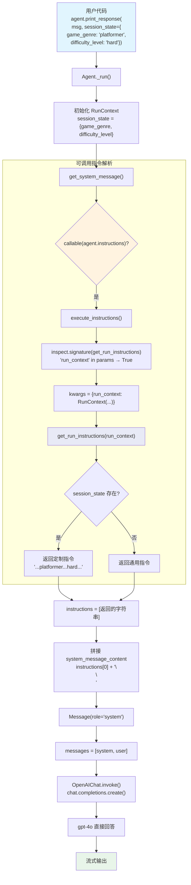

# instructions_with_state.py — 实现原理分析

> 源文件：`02_agents/context_management/instructions_with_state.py`

## 概述

本示例展示 Agno 的 **可调用指令（Callable Instructions）** 机制：将 `instructions` 参数设置为一个**函数**而非字符串/列表，该函数在每次 `_run()` 时被调用，接收 `RunContext`（含 `session_state`），动态生成指令文本。本例通过 `session_state` 中的 `game_genre` 和 `difficulty_level` 为游戏开发助手定制专业指令。

**核心配置一览：**

| 配置项 | 值 | 说明 |
|--------|------|------|
| `model` | `OpenAIChat(id="gpt-4o")` | Chat Completions API |
| `instructions` | `get_run_instructions`（函数） | 可调用指令，非字符串 |
| `tools` | `None` | 无工具 |
| `session_state` | `{"game_genre": "platformer", "difficulty_level": "hard"}` | 运行时传入 |

---

## 架构分层

```
用户代码层                agno.agent 层                agno.utils 层
┌──────────────────┐    ┌──────────────────────┐    ┌──────────────────────┐
│ instructions_    │    │ Agent._run()         │    │ utils/agent.py       │
│ with_state.py    │    │                      │    │                      │
│                  │    │ _messages.py         │    │ execute_instructions │
│ instructions=    │───>│  get_system_message()│───>│  ()                  │
│  get_run_        │    │   callable(instr)?   │    │  inspect.signature() │
│  instructions    │    │   → execute_         │    │  "run_context" in    │
│  (func)          │    │     instructions()   │    │    params → 注入     │
│                  │    │                      │    │                      │
│ session_state=   │    │   → 返回 str         │    │  调用函数 → str      │
│  {game_genre:    │    │   → 拼接到 prompt    │    │                      │
│   "platformer"   │    │                      │    │                      │
│   ...}           │    │                      │    │                      │
└──────────────────┘    └──────────────────────┘    └──────────────────────┘
                                │
                                ▼
                        ┌──────────────┐
                        │ OpenAIChat   │
                        │ gpt-4o       │
                        └──────────────┘
```

---

## 核心组件解析

### 可调用指令的检测与执行

在 `get_system_message()`（`_messages.py:164-174`）中检测 `instructions` 是否为 callable：

```python
# 3.1 Build the list of instructions for the system message
instructions: List[str] = []
if agent.instructions is not None:
    _instructions = agent.instructions
    if callable(agent.instructions):              # ← 本例命中
        _instructions = execute_instructions(
            agent=agent,
            instructions=agent.instructions,      # get_run_instructions 函数
            session_state=session_state,           # {"game_genre": "platformer", ...}
            run_context=run_context,
        )

    if isinstance(_instructions, str):            # 函数返回 str → 追加
        instructions.append(_instructions)
    elif isinstance(_instructions, list):          # 函数也可返回 List[str]
        instructions.extend(_instructions)
```

### execute_instructions 签名注入

`execute_instructions()`（`utils/agent.py:899-929`）使用与 `invoke_callable_factory()` 相同的签名检查模式：

```python
def execute_instructions(instructions, agent, team, session_state, run_context):
    import inspect
    signature = inspect.signature(instructions)
    instruction_args: Dict[str, Any] = {}

    if "agent" in signature.parameters:
        instruction_args["agent"] = agent
    if "team" in signature.parameters:
        instruction_args["team"] = team
    if "session_state" in signature.parameters:
        instruction_args["session_state"] = session_state or {}
    if "run_context" in signature.parameters:       # ← 本例命中
        instruction_args["run_context"] = run_context

    return instructions(**instruction_args)
    # → get_run_instructions(run_context=RunContext(...))
```

本例函数签名为 `get_run_instructions(run_context: RunContext)`，因此注入 `run_context` 参数。

### 指令函数逻辑

```python
def get_run_instructions(run_context: RunContext) -> str:
    if not run_context.session_state:
        # 无 session_state → 通用指令
        return "你是一个乐于助人的游戏开发助手，可以回答有关编码和游戏设计的问题。"

    game_genre = run_context.session_state.get("game_genre", "")       # "platformer"
    difficulty_level = run_context.session_state.get("difficulty_level", "")  # "hard"

    return dedent(f"""
        你是一个专业的游戏开发助手。
        团队目前正在开发一个 {game_genre} 游戏。
        当前项目难度级别设置为 {difficulty_level}。
        在提供编码建议、设计建议或技术指导时，请根据此类型和复杂性级别定制你的响应。""")
```

函数返回 `str`，在 `get_system_message()` 中作为单条指令追加到 instructions 列表。

### 可调用指令 vs 可调用工厂

两者使用相同的签名检查机制，但作用层不同：

| 特性 | 可调用指令 (instructions) | 可调用工厂 (tools/members) |
|------|------------------------|--------------------------|
| 作用 | 动态生成 system prompt 内容 | 动态生成工具/成员列表 |
| 检测位置 | `_messages.py:166` | `_tools.py` / `callables.py` |
| 执行函数 | `execute_instructions()` | `invoke_callable_factory()` |
| 缓存 | 无缓存（每次都调用） | 支持 `cache_callables` |
| 返回类型 | `str` 或 `List[str]` | 工具列表 / 成员列表 |
| 注入参数 | agent, team, session_state, run_context | agent, team, run_context, session_state |

---

## System Prompt 组装

| 序号 | 组成部分 | 本文件中的值/来源 | 是否生效 |
|------|---------|-----------------|---------|
| 1 | `description` | `None` | 否 |
| 2 | `role` | `None` | 否 |
| 3 | `instructions` | `get_run_instructions(run_context)` → 动态字符串 | **生效** |
| 4 | `additional_information` | 全部默认关闭 | 否 |
| 5-12 | 其余段落 | 均为空/关闭 | 否 |

### 最终 System Prompt

当 `session_state={"game_genre": "platformer", "difficulty_level": "hard"}` 时：

```text
你是一个专业的游戏开发助手。
团队目前正在开发一个 platformer 游戏。
当前项目难度级别设置为 hard。
在提供编码建议、设计建议或技术指导时，请根据此类型和复杂性级别定制你的响应。
```

当 `session_state` 为空时：

```text
你是一个乐于助人的游戏开发助手，可以回答有关编码和游戏设计的问题。
```

> 函数返回 `str`（单条指令），拼接方式为直接追加 + `"\n\n"`（`_messages.py:250`）。

---

## 完整 API 请求

```python
client.chat.completions.create(
    model="gpt-4o",
    messages=[
        {
            "role": "developer",
            "content": "你是一个专业的游戏开发助手。\n团队目前正在开发一个 platformer 游戏。\n当前项目难度级别设置为 hard。\n在提供编码建议、设计建议或技术指导时，请根据此类型和复杂性级别定制你的响应。\n\n"
        },
        {
            "role": "user",
            "content": "What genre are we working on and what should I focus on for the core mechanics?"
        }
    ],
    stream=True,
    stream_options={"include_usage": True}
)
```

> 无 tools，LLM 根据注入的游戏类型（platformer）和难度（hard）直接回答核心机制建议。

---

## 动态指令对比

```
session_state=None                      session_state={genre, difficulty}
┌───────────────────────┐          ┌───────────────────────┐
│ get_run_instructions  │          │ get_run_instructions  │
│   (run_context)       │          │   (run_context)       │
│                       │          │                       │
│ run_context.          │          │ run_context.          │
│   session_state       │          │   session_state       │
│   = None/{}           │          │   = {"game_genre":    │
│                       │          │     "platformer",     │
│         ↓             │          │     "difficulty_level":│
│                       │          │     "hard"}           │
│ "你是一个乐于助人的    │          │         ↓             │
│  游戏开发助手..."     │          │                       │
│                       │          │ "你是一个专业的游戏    │
│ （通用指令）          │          │  开发助手。团队目前    │
│                       │          │  正在开发一个          │
│                       │          │  platformer 游戏..."  │
│                       │          │                       │
│                       │          │ （定制指令）           │
└───────────────────────┘          └───────────────────────┘
```

---

## Mermaid 流程图



---

## 关键源码文件索引

| 文件 | 关键函数/类 | 作用 |
|------|------------|------|
| `agno/agent/_messages.py` | `get_system_message()` L164-174 | 检测 callable instructions 并调用 |
| `agno/utils/agent.py` | `execute_instructions()` L899 | 签名检查 + 参数注入 + 调用指令函数 |
| `agno/agent/agent.py` | `instructions` 属性 | 支持 str / List[str] / Callable |
| `agno/run/__init__.py` | `RunContext` | 运行上下文（含 session_state, user_id 等） |
| `agno/models/openai/chat.py` | `OpenAIChat` | Chat Completions API（role: developer） |
