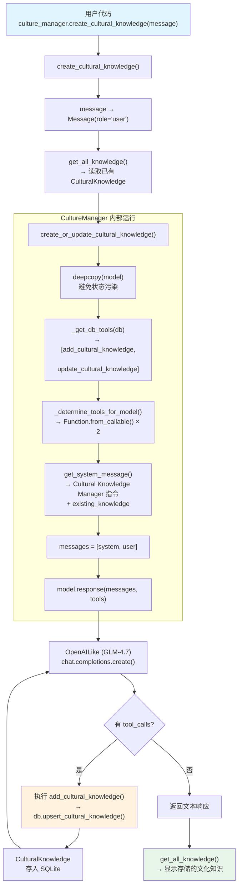

# 01_create_cultural_knowledge.py — 实现原理分析

> 源文件：`02_agents/culture/01_create_cultural_knowledge.py`

## 概述

本示例展示如何**独立使用 `CultureManager` 创建文化知识**，不涉及 Agent 运行。`CultureManager` 自身就是一个"迷你 Agent"：它有自己的模型、system prompt 和工具（`add_cultural_knowledge`/`update_cultural_knowledge`），接收用户输入的文本，通过 LLM 将其提炼为结构化的 `CulturalKnowledge` 条目并存入数据库。后续 Agent 可通过 `add_culture_to_context=True` 加载这些知识。

**核心配置一览：**

| 配置项 | 值 | 说明 |
|--------|------|------|
| `CultureManager.model` | `OpenAILike(id="GLM-4.7")` | 智谱 GLM，OpenAI 兼容 API |
| `CultureManager.db` | `SqliteDb(db_file="tmp/demo.db")` | SQLite 存储文化知识 |
| 调用方式 | `culture_manager.create_cultural_knowledge(message=...)` | 直接调用，非 Agent 运行 |

---

## 架构分层

```
用户代码层                  agno.culture 层                    agno.models 层
┌───────────────────┐    ┌──────────────────────────┐    ┌──────────────────┐
│ 01_create_        │    │ CultureManager           │    │ OpenAILike       │
│ cultural_         │    │                          │    │ (GLM-4.7)        │
│ knowledge.py      │    │ create_cultural_         │    │                  │
│                   │    │   knowledge(message)     │    │ system prompt:   │
│ culture_manager.  │───>│   ├ get_all_knowledge()  │    │   Cultural       │
│ create_cultural_  │    │   │  → 读取已有知识      │    │   Knowledge      │
│ knowledge(msg)    │    │   ├ get_system_message()  │───>│   Manager 指令   │
│                   │    │   │  → 构建提示词        │    │                  │
│ get_all_          │    │   ├ _get_db_tools()      │    │ tools:           │
│ knowledge()       │    │   │  → 生成数据库工具    │    │   add/update     │
│                   │    │   └ model.response()     │    │   cultural_      │
│                   │    │      → LLM 提炼 + 调用   │    │   knowledge      │
│                   │    │        工具存储          │    │                  │
└───────────────────┘    └──────────────────────────┘    └──────────────────┘
                                    │
                                    ▼
                            ┌──────────────┐
                            │ SqliteDb     │
                            │ (tmp/demo.db)│
                            └──────────────┘
```

---

## 核心组件解析

### CultureManager 内部运行流程

`create_cultural_knowledge(message)` 的完整流程（`culture/manager.py:175-211`）：

```python
def create_cultural_knowledge(self, message):
    # 1. 将文本包装为 Message
    messages = [Message(role="user", content=message)]

    # 2. 读取已有文化知识
    existing_knowledge = self.get_all_knowledge()  # → []（首次）
    existing_knowledge_dicts = [k.to_dict() for k in existing_knowledge]

    # 3. 调用 create_or_update_cultural_knowledge()
    response = self.create_or_update_cultural_knowledge(
        messages=messages,
        existing_knowledge=existing_knowledge_dicts,
        db=self.db,
        update_knowledge=True,
        add_knowledge=True,
    )
```

`create_or_update_cultural_knowledge()` 是核心（L453-502）：

```python
def create_or_update_cultural_knowledge(self, messages, existing_knowledge, db, ...):
    model_copy = deepcopy(self.model)  # 深拷贝模型避免状态污染

    # 1. 构建工具列表（add/update 两个函数）
    _tools = self._determine_tools_for_model(
        self._get_db_tools(db, enable_add_knowledge=True, enable_update_knowledge=True,
                           enable_delete_knowledge=False, enable_clear_knowledge=False)
    )

    # 2. 构建消息数组
    messages_for_model = [
        self.get_system_message(existing_knowledge=existing_knowledge, ...),
        *messages,  # 用户输入
    ]

    # 3. 调用模型（含工具调用循环）
    response = model_copy.response(messages=messages_for_model, tools=_tools)
```

### CultureManager 的 System Prompt

`get_system_message()` 构建一个详细的文化知识管理指令（L342-451），核心结构：

```text
You are the **Cultural Knowledge Manager**, responsible for maintaining, evolving,
and safeguarding the shared cultural knowledge for Agents and Multi-Agent Teams.

Given a user message, your task is to distill, organize, and extract collective
intelligence from it...

## When to add or update cultural knowledge
- Decide if knowledge should be added, updated, deleted, or if no changes are needed...

## How to add or update cultural knowledge
- Write entries that are clear, specific, and actionable...

## Criteria for creating cultural knowledge
<knowledge_to_capture>
  Cultural knowledge should capture shared knowledge, insights, and practices...
</knowledge_to_capture>

## Metadata & structure
- `name`: short, specific title (required).
- `summary`: one-line purpose or takeaway.
- `content`: reusable insight, rule, or guideline (required).
- `categories`: list of tags...
...

## Tool usage
- Add new entries using the `add_knowledge` tool.
- Update existing entries using the `update_knowledge` tool.

<existing_knowledge>
  （已有的文化知识条目，首次为空）
</existing_knowledge>

## When no changes are needed
If no valuable cultural knowledge emerges... respond with exactly:
`No changes needed`
```

### 数据库工具

`_get_db_tools()` 生成闭包函数作为 LLM 工具：

| 工具名 | 参数 | 作用 |
|--------|------|------|
| `add_cultural_knowledge` | `name, summary?, content?, categories?` | 创建新的 CulturalKnowledge 并存入 DB |
| `update_cultural_knowledge` | `knowledge_id, name, summary?, content?, categories?` | 更新已有条目 |

这些函数通过 `Function.from_callable()` 转为 JSON Schema，与 Agent 的工具解析流程完全一致。

### CulturalKnowledge 数据模型

```python
@dataclass
class CulturalKnowledge:
    id: Optional[str] = None           # UUID，自动生成
    name: Optional[str] = None         # 简短标题
    content: Optional[str] = None      # 可重用的洞察/规则/指南
    categories: Optional[List[str]] = None  # 标签列表
    notes: Optional[List[str]] = None  # 上下文注释
    summary: Optional[str] = None      # 一行摘要
    metadata: Optional[Dict] = None    # 结构化元数据
    created_at: Optional[int] = None
    updated_at: Optional[int] = None
```

---

## 完整 API 请求

CultureManager 使用 **OpenAILike**（Chat Completions API，`system` role 不映射为 `developer`）：

```python
client.chat.completions.create(
    model="GLM-4.7",
    messages=[
        {
            "role": "system",    # OpenAILike 保持 system
            "content": "You are the **Cultural Knowledge Manager**...\n\n## Tool usage\n- Add new entries using the `add_knowledge` tool.\n- Update existing entries using the `update_knowledge` tool.\n\n## When no changes are needed\n..."
        },
        {
            "role": "user",
            "content": "所有技术指导都应遵循'操作性思维'原则：\n\n1. **陈述目标** — 我们试图实现什么结果以及为什么。\n2. **展示过程** — 列出清晰、可复现的步骤...\n..."
        }
    ],
    tools=[
        {
            "type": "function",
            "function": {
                "name": "add_cultural_knowledge",
                "description": "Use this function to add a cultural knowledge to the database.",
                "parameters": {
                    "type": "object",
                    "properties": {
                        "name": {"type": "string", "description": "(str) The name of the cultural knowledge. Short, specific title."},
                        "summary": {"type": "string", "description": "(str) The summary of the cultural knowledge. One-line purpose or takeaway."},
                        "content": {"type": "string", "description": "(str) The content of the cultural knowledge. Reusable insight, rule, or guideline."},
                        "categories": {"type": "array", "items": {"type": "string"}, "description": "(List[str]) The categories of the cultural knowledge."}
                    },
                    "required": ["name"]
                }
            }
        },
        {
            "type": "function",
            "function": {
                "name": "update_cultural_knowledge",
                "description": "Use this function to update an existing cultural knowledge in the database.",
                "parameters": {
                    "type": "object",
                    "properties": {
                        "knowledge_id": {"type": "string"},
                        "name": {"type": "string"},
                        "summary": {"type": "string"},
                        "content": {"type": "string"},
                        "categories": {"type": "array", "items": {"type": "string"}}
                    },
                    "required": ["knowledge_id", "name"]
                }
            }
        }
    ]
)
```

### 工具调用循环

```
第 1 轮: [system, user] → GLM-4.7 → assistant(tool_calls: add_cultural_knowledge)
  └─ 执行 add_cultural_knowledge(name="操作性思维原则", content="...", categories=["principles",...])
     → 存入 SQLite → "Cultural knowledge added successfully"
第 2 轮: [..., tool_result] → GLM-4.7 → assistant(纯文本 或 更多 tool_calls)
```

---

## Mermaid 流程图



---

## 关键源码文件索引

| 文件 | 关键函数/类 | 作用 |
|------|------------|------|
| `agno/culture/manager.py` | `CultureManager` L23 | 文化知识管理器 dataclass |
| `agno/culture/manager.py` | `create_cultural_knowledge()` L175 | 从消息创建文化知识 |
| `agno/culture/manager.py` | `create_or_update_cultural_knowledge()` L453 | 核心：构建消息+工具，调用模型 |
| `agno/culture/manager.py` | `get_system_message()` L342 | Cultural Knowledge Manager 指令 |
| `agno/culture/manager.py` | `_get_db_tools()` L734 | 生成 add/update/delete/clear 工具 |
| `agno/culture/manager.py` | `get_all_knowledge()` L123 | 读取所有文化知识 |
| `agno/db/schemas/culture.py` | `CulturalKnowledge` L9 | 文化知识数据模型 |
| `agno/models/openai/like.py` | `OpenAILike` | OpenAI 兼容 API（role: system） |
