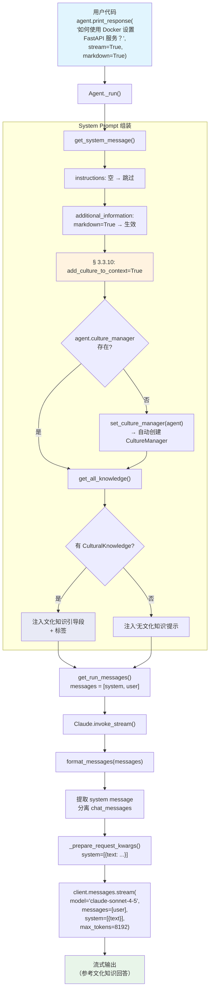

# 02_use_cultural_knowledge_in_agent.py — 实现原理分析

> 源文件：`02_agents/culture/02_use_cultural_knowledge_in_agent.py`

## 概述

本示例展示如何**在 Agent 中使用已有的文化知识**：通过 `add_culture_to_context=True` 让 Agent 在 `get_system_message()` 时从 SQLite 数据库中读取所有 `CulturalKnowledge` 条目，将其注入到 system prompt 的 `<cultural_knowledge>` 段中。Agent 在回答用户问题时会参考这些文化知识（如响应格式偏好、技术解释风格等）。本例依赖 `01_create_cultural_knowledge.py` 预先创建的文化知识数据。

**核心配置一览：**

| 配置项 | 值 | 说明 |
|--------|------|------|
| `model` | `Claude(id="claude-sonnet-4-5")` | Anthropic Messages API |
| `db` | `SqliteDb(db_file="tmp/demo.db")` | 与 01 共享同一数据库 |
| `add_culture_to_context` | `True` | 将文化知识注入 system prompt |
| `update_cultural_knowledge` | `False`（注释掉） | 不自动更新文化知识 |
| `instructions` | `None` | 未设置 |
| `tools` | `None` | 无工具 |

---

## 架构分层

```
用户代码层                agno.agent 层                     Anthropic 适配层
┌──────────────────┐    ┌──────────────────────────┐    ┌──────────────────┐
│ 02_use_cultural_ │    │ Agent._run()             │    │ Claude           │
│ knowledge_in_    │    │                          │    │ (claude-sonnet-  │
│ agent.py         │    │ _messages.py             │    │  4-5)            │
│                  │    │  get_system_message()    │    │                  │
│ add_culture_to_  │───>│   § 3.3.10: culture     │    │ invoke_stream()  │
│ context=True     │    │     injection           │    │  format_messages()│
│                  │    │   → <cultural_knowledge> │    │   → system 提取  │
│ db=SqliteDb      │    │     + 每条 Knowledge     │    │   → chat_messages│
│ (tmp/demo.db)    │    │                          │    │                  │
│                  │    │  get_run_messages()      │───>│ _prepare_request │
│                  │    │   [system, user]         │    │  _kwargs()       │
│                  │    │                          │    │   system=[{text}] │
└──────────────────┘    └──────────────────────────┘    └──────────────────┘
                                │                              │
                        ┌───────┘                              ▼
                        ▼                              ┌──────────────┐
                ┌──────────────┐                       │ Anthropic API│
                │ SqliteDb     │                       │ messages.    │
                │ (tmp/demo.db)│                       │ create()     │
                └──────────────┘                       └──────────────┘
```

---

## 核心组件解析

### add_culture_to_context 注入流程

`add_culture_to_context=True` 在 `get_system_message()` 的 **§ 3.3.10** 触发文化知识注入（`_messages.py:322-381`）：

```python
# 3.3.10 Then add cultural knowledge to the system prompt
if agent.add_culture_to_context:
    _culture_manager_not_set = False
    if not agent.culture_manager:
        set_culture_manager(agent)      # 自动创建 CultureManager
        _culture_manager_not_set = True

    cultural_knowledge = agent.culture_manager.get_all_knowledge()

    if cultural_knowledge and len(cultural_knowledge) > 0:
        system_message_content += (
            "You have access to shared **Cultural Knowledge**, which provides context, "
            "norms, rules and guidance for your reasoning, communication, and decision-making..."
        )
        system_message_content += "<cultural_knowledge>"
        for _knowledge in cultural_knowledge:
            system_message_content += "\n---"
            system_message_content += f"\nName: {_knowledge.name}"
            system_message_content += f"\nSummary: {_knowledge.summary}"
            system_message_content += f"\nContent: {_knowledge.content}"
        system_message_content += "\n</cultural_knowledge>\n"
    else:
        # 无文化知识时的提示
        system_message_content += "You have the capability to access shared **Cultural Knowledge**..."
```

### set_culture_manager 自动初始化

由于代码中没有显式传入 `culture_manager`，`set_culture_manager()`（`_init.py:81-95`）会在首次访问时自动创建：

```python
def set_culture_manager(agent: Agent) -> None:
    if agent.culture_manager is None:
        agent.culture_manager = CultureManager(model=agent.model, db=agent.db)
        # → CultureManager(model=Claude("claude-sonnet-4-5"), db=SqliteDb("tmp/demo.db"))
    else:
        if agent.culture_manager.model is None:
            agent.culture_manager.model = agent.model
        if agent.culture_manager.db is None:
            agent.culture_manager.db = agent.db
```

虽然自动创建了 CultureManager，但因为 `update_cultural_knowledge=False`，CultureManager 的模型不会被调用——仅用于从数据库**读取**已有知识。

### Anthropic Claude 模型的 API 格式

与 OpenAIChat/OpenAILike 不同，Claude 适配器将 system message 从 messages 数组中**提取出来**，作为独立的 `system` 参数传入：

```python
# format_messages() — agno/utils/models/claude.py:265-365
def format_messages(messages, compress_tool_results=False):
    chat_messages = []
    system_messages = []

    for message in messages:
        if message.role in ("system", "developer"):
            system_messages.append(content)  # 提取为系统消息
            continue
        elif message.role == "user":
            content = [{"type": "text", "text": content}]  # Anthropic 要求 content 为数组
        ...

    return chat_messages, " ".join(system_messages)  # 返回分离的消息和系统文本
```

然后在 `_prepare_request_kwargs()` 中：

```python
# claude.py:549-558
if system_message:
    request_kwargs["system"] = [{"text": system_message, "type": "text"}]
```

### 流式输出

`print_response()` 默认使用流式模式，触发 `invoke_stream()`：

```python
# claude.py:639-688
def invoke_stream(self, messages, ...):
    chat_messages, system_message = format_messages(messages)
    request_kwargs = self._prepare_request_kwargs(system_message, tools=tools, ...)

    with self.get_client().messages.stream(
        model=self.id,
        messages=chat_messages,
        **request_kwargs,
    ) as stream:
        for chunk in stream:
            yield self._parse_provider_response_delta(chunk)
```

---

## System Prompt 组装

| 序号 | 组成部分 | 本文件中的值/来源 | 是否生效 |
|------|---------|-----------------|---------|
| 1 | `description` | `None` | 否 |
| 2 | `role` | `None` | 否 |
| 3 | `instructions` | `None` | 否 |
| 4.1 | `markdown` | `True`（print_response 传入） | **生效** |
| 4.2-4.4 | 其余 additional_information | 默认关闭 | 否 |
| 5-9 | tools/memory/knowledge 等 | 均无 | 否 |
| 10 | `add_culture_to_context` | `True` | **生效** |
| 11-12 | session_summary 等 | 默认关闭 | 否 |

### 最终 System Prompt

假设 01 中创建了"操作性思维原则"文化知识：

```text
<additional_information>
- Use markdown to format your answers.
</additional_information>

You have access to shared **Cultural Knowledge**, which provides context, norms, rules and guidance for your reasoning, communication, and decision-making. Cultural Knowledge represents the collective understanding, values, rules and practices that have emerged across agents and teams. It encodes collective experience — including preferred approaches, common patterns, lessons learned, and ethical guardrails.

When performing any task:
- **Reference Cultural Knowledge** to align with shared norms and best practices.
- **Apply it contextually**, not mechanically — adapt principles to the current situation.
- **Preserve consistency** with cultural values (tone, reasoning, and style) unless explicitly told otherwise.
- **Extend it** when you discover new insights — your outputs may become future Cultural Knowledge.
- **Clarify conflicts** if Cultural Knowledge appears to contradict explicit user instructions.

Your goal is to act not only intelligently but also *culturally coherently* — reflecting the collective intelligence of the system.

Below is the currently available Cultural Knowledge for this context:

<cultural_knowledge>
---
Name: 操作性思维原则
Summary: 所有技术指导都应遵循操作性思维原则...
Content: 1. 陈述目标 — 我们试图实现什么结果以及为什么...
</cultural_knowledge>
```

> 如果数据库中无文化知识，则注入"no cultural knowledge is currently available"的提示段落。

---

## 完整 API 请求

Anthropic Messages API 格式——system 作为独立参数：

```python
client.messages.stream(
    model="claude-sonnet-4-5",
    messages=[
        {
            "role": "user",
            "content": [{"type": "text", "text": "如何使用 Docker 设置 FastAPI 服务？"}]
        }
    ],
    system=[
        {
            "type": "text",
            "text": "<additional_information>\n- Use markdown to format your answers.\n</additional_information>\n\nYou have access to shared **Cultural Knowledge**...\n\n<cultural_knowledge>\n---\nName: 操作性思维原则\nSummary: ...\nContent: ...\n</cultural_knowledge>\n"
        }
    ],
    max_tokens=8192
)
```

关键区别对比：

| 特性 | OpenAIChat | Anthropic Claude |
|------|-----------|-----------------|
| system message | `messages[0]` 中 `role: "developer"` | 独立 `system` 参数 |
| user content | `str` | `[{"type": "text", "text": str}]`（数组） |
| 流式方式 | `stream=True` 参数 | `messages.stream()` 上下文管理器 |
| 默认 max_tokens | 无限制 | `8192` |

---

## Mermaid 流程图



---

## 关键源码文件索引

| 文件 | 关键函数/类 | 作用 |
|------|------------|------|
| `agno/agent/_messages.py` | `get_system_message()` L322-381 | § 3.3.10 文化知识注入逻辑 |
| `agno/agent/_init.py` | `set_culture_manager()` L81 | 自动创建 CultureManager |
| `agno/culture/manager.py` | `get_all_knowledge()` L123 | 从数据库读取所有文化知识 |
| `agno/db/schemas/culture.py` | `CulturalKnowledge` L9 | 文化知识数据模型 |
| `agno/models/anthropic/claude.py` | `Claude` L67 | Anthropic 模型适配器 |
| `agno/models/anthropic/claude.py` | `invoke_stream()` L639 | 流式调用 Messages API |
| `agno/models/anthropic/claude.py` | `_prepare_request_kwargs()` L527 | system 参数构建 |
| `agno/utils/models/claude.py` | `format_messages()` L265 | 将 Message 列表转为 Anthropic 格式（system 分离） |
| `agno/agent/agent.py` | `add_culture_to_context` L329 | Agent 属性（控制文化知识注入） |
