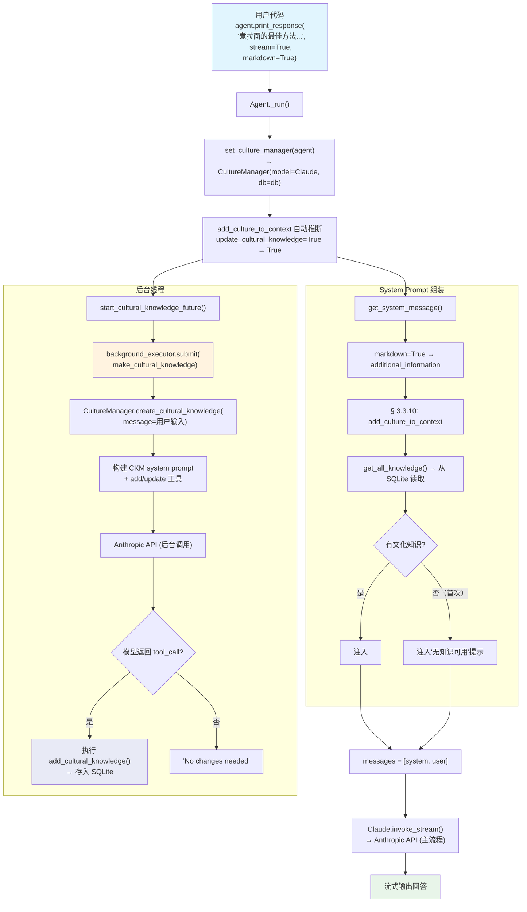

# 03_automatic_cultural_management.py — 实现原理分析

> 源文件：`02_agents/culture/03_automatic_cultural_management.py`

## 概述

本示例展示 Agno 的 **`update_cultural_knowledge=True`（自动文化知识管理）** 机制：Agent 在每次 `_run()` 完成后，自动在**后台线程**中调用 `CultureManager.create_cultural_knowledge()`，将用户的输入消息传给 CultureManager（一个"迷你 Agent"），由 CultureManager 的模型判断是否从中提取新的文化知识并存入数据库。这样，随着用户与 Agent 的交互，文化知识会自动积累和演化。

**核心配置一览：**

| 配置项 | 值 | 说明 |
|--------|------|------|
| `model` | `Claude(id="claude-sonnet-4-5")` | Anthropic Messages API |
| `db` | `SqliteDb(db_file="tmp/demo.db")` | SQLite 存储 |
| `update_cultural_knowledge` | `True` | 每次运行后自动更新文化知识 |
| `add_culture_to_context` | 自动推断为 `True` | 因 `update_cultural_knowledge=True` 自动开启 |
| `instructions` | `None` | 未设置 |
| `tools` | `None` | 无工具 |

---

## 架构分层

```
用户代码层                agno.agent 层                    后台线程
┌──────────────────┐    ┌──────────────────────────┐    ┌──────────────────┐
│ 03_automatic_    │    │ Agent._run()             │    │ background_      │
│ cultural_        │    │                          │    │ executor         │
│ management.py    │    │ 1. get_system_message()  │    │                  │
│                  │    │    § 3.3.10: culture     │    │ make_cultural_   │
│ update_cultural_ │───>│    injection             │    │ knowledge()      │
│ knowledge=True   │    │                          │    │                  │
│                  │    │ 2. 调用模型 → 响应       │    │ CultureManager.  │
│                  │    │                          │    │ create_cultural_ │
│                  │    │ 3. _run() 末尾:          │    │ knowledge(msg)   │
│                  │    │    start_cultural_       │───>│                  │
│                  │    │    knowledge_future()    │    │ → 模型判断是否   │
│                  │    │    → 后台线程            │    │   需要 add/update│
│                  │    │                          │    │   cultural       │
│                  │    │                          │    │   knowledge      │
└──────────────────┘    └──────────────────────────┘    └──────────────────┘
                                │                              │
                        ┌───────┘                              │
                        ▼                                      ▼
                ┌──────────────┐                       ┌──────────────┐
                │ Claude       │                       │ SqliteDb     │
                │ (Agent 模型) │                       │ (tmp/demo.db)│
                └──────────────┘                       └──────────────┘
```

---

## 核心组件解析

### add_culture_to_context 自动推断

在 `set_culture_manager()`（`_init.py:81-95`）中，当 `add_culture_to_context` 未显式设置时，会根据相关标志自动推断：

```python
def set_culture_manager(agent: Agent) -> None:
    if agent.culture_manager is None:
        agent.culture_manager = CultureManager(model=agent.model, db=agent.db)

    if agent.add_culture_to_context is None:
        agent.add_culture_to_context = (
            agent.enable_agentic_culture
            or agent.update_cultural_knowledge    # ← True → 自动开启
            or agent.culture_manager is not None
        )
```

因此本例虽未设置 `add_culture_to_context`，但因为 `update_cultural_knowledge=True`，它被自动推断为 `True`。这意味着：
1. **读取**：system prompt 中注入已有文化知识
2. **写入**：运行后自动提取新文化知识

### 后台文化知识创建

`_run()` 在调用模型前启动后台线程（`_managers.py:297-322`）：

```python
def start_cultural_knowledge_future(agent, run_messages, existing_future=None):
    """在后台线程中启动文化知识创建。"""
    # 取消已有的 future（防止重试时重复）
    if existing_future is not None and not existing_future.done():
        existing_future.cancel()

    # 条件检查：有用户消息 + 有 CultureManager + 启用了自动更新
    if (run_messages.user_message is not None
            and agent.culture_manager is not None
            and agent.update_cultural_knowledge):
        return agent.background_executor.submit(
            make_cultural_knowledge, agent, run_messages=run_messages
        )
    return None
```

`make_cultural_knowledge()` 是实际执行函数（`_managers.py:248-254`）：

```python
def make_cultural_knowledge(agent, run_messages):
    if (run_messages.user_message is not None
            and agent.culture_manager is not None
            and agent.update_cultural_knowledge):
        agent.culture_manager.create_cultural_knowledge(
            message=run_messages.user_message.get_content_string()
        )
```

### CultureManager 的后台运行

`create_cultural_knowledge(message)` 在后台线程中执行完整的"迷你 Agent"流程（参考 01 的分析）：

```
后台线程:
  message = "煮拉面的最佳方法是什么？详细和具体的指导通常比一般性建议效果更好。"
  ↓
  CultureManager.create_cultural_knowledge(message)
  ↓
  1. 读取已有文化知识
  2. 构建 system prompt（Cultural Knowledge Manager 指令）
  3. 调用 Claude 模型判断是否需要创建/更新文化知识
  4. 如果模型返回 tool_call（add/update_cultural_knowledge）
     → 执行工具 → 存入 SQLite
  5. 如果模型判断"No changes needed"
     → 不做任何操作
```

CultureManager 使用与 Agent **相同的模型实例**（`Claude(id="claude-sonnet-4-5")`），因为 `set_culture_manager()` 将 `agent.model` 传递给了 CultureManager。这意味着后台线程中会发起一个**独立的** Anthropic API 调用。

### 两次 API 调用

本例一次运行会产生**两个** API 调用（可能并行）：

| 调用 | 发起方 | 线程 | 目的 |
|------|--------|------|------|
| 1 | Agent（主流程） | 主线程 | 回答用户问题"煮拉面的最佳方法" |
| 2 | CultureManager（后台） | 后台线程 | 分析用户消息是否包含可提取的文化知识 |

调用 2 中，CultureManager 可能从用户消息"详细和具体的指导通常比一般性建议效果更好"中提取出一条文化知识，如"偏好详细具体的指导而非一般性建议"。

---

## System Prompt 组装

| 序号 | 组成部分 | 本文件中的值/来源 | 是否生效 |
|------|---------|-----------------|---------|
| 1 | `description` | `None` | 否 |
| 2 | `role` | `None` | 否 |
| 3 | `instructions` | `None` | 否 |
| 4.1 | `markdown` | `True`（print_response 传入） | **生效** |
| 4.2-4.4 | 其余 additional_information | 默认关闭 | 否 |
| 5-9 | tools/memory/knowledge 等 | 均无 | 否 |
| 10 | `add_culture_to_context` | 自动推断为 `True` | **生效** |
| 11-12 | session_summary 等 | 默认关闭 | 否 |

### 最终 System Prompt

首次运行（数据库中无文化知识时）：

```text
<additional_information>
- Use markdown to format your answers.
</additional_information>

You have the capability to access shared **Cultural Knowledge**, which normally provides context, norms, and guidance for your behavior and reasoning. However, no cultural knowledge is currently available in this session.
Proceed thoughtfully and document any useful insights you create — they may become future Cultural Knowledge for others.
```

后续运行（假设后台已提取了文化知识）：

```text
<additional_information>
- Use markdown to format your answers.
</additional_information>

You have access to shared **Cultural Knowledge**, which provides context, norms, rules and guidance...

<cultural_knowledge>
---
Name: 偏好详细指导
Summary: 偏好提供详细具体的指导而非一般性建议
Content: 在给出技术或操作指导时...
</cultural_knowledge>
```

---

## 完整 API 请求

### 调用 1：Agent 主流程（流式）

```python
# Anthropic Messages API
client.messages.stream(
    model="claude-sonnet-4-5",
    messages=[
        {
            "role": "user",
            "content": [{"type": "text", "text": "煮拉面的最佳方法是什么？详细和具体的指导通常比一般性建议效果更好。"}]
        }
    ],
    system=[
        {
            "type": "text",
            "text": "<additional_information>\n- Use markdown to format your answers.\n</additional_information>\n\nYou have the capability to access shared **Cultural Knowledge**...\n\n"
        }
    ],
    max_tokens=8192
)
```

### 调用 2：CultureManager 后台（非流式）

```python
# CultureManager 使用同一模型发起独立调用
client.messages.create(
    model="claude-sonnet-4-5",
    messages=[
        {
            "role": "user",
            "content": [{"type": "text", "text": "煮拉面的最佳方法是什么？详细和具体的指导通常比一般性建议效果更好。"}]
        }
    ],
    system=[
        {
            "type": "text",
            "text": "You are the **Cultural Knowledge Manager**, responsible for maintaining, evolving, and safeguarding the shared cultural knowledge...\n\n## Tool usage\n- Add new entries using the `add_knowledge` tool...\n\n<existing_knowledge>\n(已有知识或空)\n</existing_knowledge>"
        }
    ],
    tools=[
        {
            "name": "add_cultural_knowledge",
            "description": "Use this function to add a cultural knowledge to the database.",
            "input_schema": {
                "type": "object",
                "properties": {
                    "name": {"type": "string", "description": "..."},
                    "summary": {"type": "string", "description": "..."},
                    "content": {"type": "string", "description": "..."},
                    "categories": {"type": "array", "items": {"type": "string"}, "description": "..."}
                },
                "required": ["name"],
                "additionalProperties": false
            }
        },
        {
            "name": "update_cultural_knowledge",
            "description": "Use this function to update an existing cultural knowledge in the database.",
            "input_schema": {
                "type": "object",
                "properties": {
                    "knowledge_id": {"type": "string", "description": "..."},
                    "name": {"type": "string", "description": "..."},
                    "summary": {"type": "string", "description": "..."},
                    "content": {"type": "string", "description": "..."},
                    "categories": {"type": "array", "items": {"type": "string"}, "description": "..."}
                },
                "required": ["knowledge_id", "name"],
                "additionalProperties": false
            }
        }
    ],
    max_tokens=8192
)
```

> 注意 Anthropic 工具格式使用 `input_schema` 而非 `parameters`，且 `name`/`description` 在顶层，无 `function` 嵌套。

---

## 运行间的知识积累

```
运行 1: "煮拉面的最佳方法是什么？详细和具体的指导通常比一般性建议效果更好。"
  ├ Agent 主流程: 回答拉面制作方法（流式）
  └ 后台线程: CultureManager 分析用户消息
    → 提取: "偏好详细指导"（add_cultural_knowledge）
    → 存入 SQLite

运行 2: "解释 Python 的装饰器概念"
  ├ Agent 主流程:
  │   system prompt 中注入:
  │   <cultural_knowledge>
  │   Name: 偏好详细指导
  │   ...
  │   </cultural_knowledge>
  │   → Agent 参考知识，给出详细具体的装饰器解释
  └ 后台线程: CultureManager 分析 → 可能无新知识 → "No changes needed"

运行 3: "用简洁的要点总结 Docker 网络模式，我们团队偏好列表格式"
  ├ Agent 主流程: 参考已有知识回答
  └ 后台线程: CultureManager 分析
    → 提取: "团队偏好列表格式"（add_cultural_knowledge）
    → 存入 SQLite，供后续运行使用
```

---

## Mermaid 流程图



---

## 关键源码文件索引

| 文件 | 关键函数/类 | 作用 |
|------|------------|------|
| `agno/agent/_managers.py` | `start_cultural_knowledge_future()` L297 | 在后台线程中启动文化知识创建 |
| `agno/agent/_managers.py` | `make_cultural_knowledge()` L248 | 后台线程中调用 CultureManager |
| `agno/agent/_init.py` | `set_culture_manager()` L81 | 自动创建 CultureManager + 推断 add_culture_to_context |
| `agno/agent/_messages.py` | `get_system_message()` L322-381 | § 3.3.10 文化知识注入 |
| `agno/culture/manager.py` | `create_cultural_knowledge()` L175 | CultureManager 核心方法 |
| `agno/culture/manager.py` | `create_or_update_cultural_knowledge()` L453 | 构建消息+工具，调用模型 |
| `agno/culture/manager.py` | `get_system_message()` L342 | CKM 系统提示词 |
| `agno/culture/manager.py` | `_get_db_tools()` L734 | 生成 add/update 工具函数 |
| `agno/agent/agent.py` | `update_cultural_knowledge` L328 | Agent 属性（启用自动更新） |
| `agno/models/anthropic/claude.py` | `Claude` L67 | Anthropic 模型适配器 |
| `agno/utils/models/claude.py` | `format_messages()` L265 | Message → Anthropic 格式（system 分离） |
| `agno/utils/models/claude.py` | `format_tools_for_model()` L368 | 工具转 Anthropic 格式（input_schema） |
