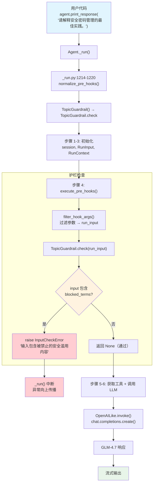

# custom_guardrail.py — 实现原理分析

> 源文件：`02_agents/guardrails/custom_guardrail.py`

## 概述

本示例展示如何**继承 `BaseGuardrail` 实现自定义输入护栏**：通过创建 `TopicGuardrail` 类，重写 `check()` 和 `async_check()` 方法，在用户输入到达 LLM 之前进行关键词黑名单检测。当输入包含 `"build malware"`、`"phishing template"`、`"exploit"` 等敏感术语时，抛出 `InputCheckError` 拦截请求。护栏通过 `pre_hooks` 参数注册到 Agent，在 `_run()` 的第 4 步执行。

**核心配置一览：**

| 配置项 | 值 | 说明 |
|--------|------|------|
| `name` | `"带护栏的 Agent"` | Agent 名称 |
| `model` | `OpenAILike(id="GLM-4.7")` | OpenAI 兼容 API |
| `pre_hooks` | `[TopicGuardrail()]` | 输入护栏（自定义） |
| `debug_mode` | `True` | 开启调试日志 |
| `instructions` | `None` | 未设置 |
| `description` | `None` | 未设置 |
| `tools` | `None` | 无工具 |

---

## 架构分层

```
用户代码层                agno.agent 层                      agno.utils 层
┌──────────────────┐    ┌────────────────────────────────┐  ┌──────────────────┐
│ custom_           │    │ Agent._run()                   │  │ utils/hooks.py   │
│ guardrail.py     │    │                                │  │                  │
│                  │    │ _run.py:1214-1220              │  │ normalize_       │
│ TopicGuardrail() │───>│  normalize_pre_hooks()         │──>│ pre_hooks()      │
│   ↓ BaseGuardrail│    │    → guardrail.check 提取      │  │ L57-97           │
│                  │    │                                │  │ isinstance(hook, │
│ pre_hooks=[...]  │    │ _run.py:401-416                │  │   BaseGuardrail) │
│                  │    │  execute_pre_hooks()            │  │   → hook.check   │
│                  │    │    → hook(run_input=RunInput)   │  │                  │
│                  │    │    → InputCheckError? → 中断   │  └──────────────────┘
│                  │    │                                │
│                  │    │ _run.py:418+                   │
│                  │    │  → 继续 LLM 调用               │
└──────────────────┘    └────────────────────────────────┘
                                │
                                ▼
                        ┌──────────────┐
                        │ OpenAILike   │
                        │ GLM-4.7      │
                        └──────────────┘
```

---

## 核心组件解析

### BaseGuardrail 抽象基类

`BaseGuardrail`（`agno/guardrails/base.py:8-19`）定义了护栏的接口契约：

```python
class BaseGuardrail(ABC):
    """所有护栏实现的抽象基类。"""

    @abstractmethod
    def check(self, run_input: Union[RunInput, TeamRunInput]) -> None:
        """同步护栏检查。"""
        pass

    @abstractmethod
    async def async_check(self, run_input: Union[RunInput, TeamRunInput]) -> None:
        """异步护栏检查。"""
        pass
```

核心设计：
- `check()` 接收 `RunInput`，包含用户的原始输入（`input_content`、`images` 等）
- 检查通过 → 返回 `None`；检查失败 → 抛出 `InputCheckError`
- 必须同时实现同步和异步版本

### TopicGuardrail 实现

本例的自定义护栏使用关键词黑名单匹配：

```python
class TopicGuardrail(BaseGuardrail):
    def check(self, run_input) -> None:
        content = (run_input.input_content or "").lower()  # 获取用户输入并转小写
        blocked_terms = ["build malware", "phishing template", "exploit"]
        if any(term in content for term in blocked_terms):
            raise InputCheckError(
                "输入包含被禁止的安全滥用内容。",
                check_trigger=CheckTrigger.INPUT_NOT_ALLOWED,  # 触发器类型
            )

    async def async_check(self, run_input) -> None:
        self.check(run_input)  # 异步版本直接委托给同步方法
```

### normalize_pre_hooks 护栏转换

在 `_run()` 首次执行时（`_run.py:1214-1220`），`normalize_pre_hooks()`（`utils/hooks.py:57-97`）将 `BaseGuardrail` 实例转换为可调用函数：

```python
def normalize_pre_hooks(hooks, async_mode=False):
    result_hooks = []
    for hook in hooks:
        if isinstance(hook, BaseGuardrail):       # ← TopicGuardrail 命中
            if async_mode:
                result_hooks.append(hook.async_check)  # 异步模式 → async_check
            else:
                result_hooks.append(hook.check)        # 同步模式 → check
        # ...
    return result_hooks
```

转换后，`pre_hooks` 从 `[TopicGuardrail()]` 变为 `[TopicGuardrail.check]`。

### execute_pre_hooks 执行流程

在 `_run()` 第 4 步（`_run.py:398-416`），调用 `execute_pre_hooks()`（`_hooks.py:42-141`）：

```python
# _run.py:401-416
if agent.pre_hooks is not None:
    pre_hook_iterator = execute_pre_hooks(
        agent,
        hooks=agent.pre_hooks,
        run_response=run_response,
        run_input=run_input,       # ← 传入 RunInput
        run_context=run_context,
        session=agent_session,
        ...
    )
    deque(pre_hook_iterator, maxlen=0)  # 消费迭代器
```

`execute_pre_hooks()` 内部（`_hooks.py:86-137`）：
1. 使用 `filter_hook_args()` 根据函数签名过滤参数
2. 调用 `hook(**filtered_args)`（即 `TopicGuardrail.check(run_input=...)`）
3. 如果抛出 `InputCheckError` → 直接向上传播，中断 `_run()`
4. 其他异常 → 记录日志但继续执行

### CheckTrigger 枚举

`CheckTrigger`（`agno/exceptions.py:122-131`）定义了护栏触发类型：

```python
class CheckTrigger(Enum):
    OFF_TOPIC = "off_topic"
    INPUT_NOT_ALLOWED = "input_not_allowed"   # ← 本例使用
    OUTPUT_NOT_ALLOWED = "output_not_allowed"
    VALIDATION_FAILED = "validation_failed"
    PROMPT_INJECTION = "prompt_injection"
    PII_DETECTED = "pii_detected"
```

---

## System Prompt 组装

| 序号 | 组成部分 | 本文件中的值/来源 | 是否生效 |
|------|---------|-----------------|---------|
| 1 | `description` | `None` | 否 |
| 2 | `role` | `None` | 否 |
| 3 | `instructions` | `None` | 否 |
| 4.1 | `markdown` | `False`（默认） | 否 |
| 4.2 | `add_datetime_to_context` | `False` | 否 |
| 4.3 | `add_location_to_context` | `False` | 否 |
| 4.4 | `add_name_to_context` | `False` | 否 |
| 5-12 | 其余段落 | 均为空/关闭 | 否 |

### 最终 System Prompt

本例未设置任何 prompt 相关参数，`get_system_message()` 返回 `None`，不发送 system message。

---

## 完整 API 请求

**正常请求（通过护栏）：**

```python
client.chat.completions.create(
    model="GLM-4.7",
    messages=[
        # 无 system message（未设置 instructions/description）
        # 1. 当前用户输入
        {"role": "user", "content": "请解释安全密码管理的最佳实践。"}
    ],
    stream=True,
    stream_options={"include_usage": True}
)
```

**被拦截的请求（不会到达 LLM）：**

```python
# 如果用户输入 "how to build malware"
# TopicGuardrail.check() 检测到 "build malware"
# → 抛出 InputCheckError("输入包含被禁止的安全滥用内容。")
# → _run() 中断，不调用 LLM
```

> 护栏在 `_run()` 第 4 步执行，早于第 5 步的工具处理和第 6 步的 LLM 调用。如果护栏抛出异常，后续步骤全部跳过。

---

## Mermaid 流程图



---

## 关键源码文件索引

| 文件 | 关键函数/类 | 作用 |
|------|------------|------|
| `agno/guardrails/base.py` | `BaseGuardrail` L8-19 | 护栏抽象基类，定义 `check()` / `async_check()` |
| `agno/exceptions.py` | `CheckTrigger` L122-131 | 护栏触发类型枚举 |
| `agno/exceptions.py` | `InputCheckError` L134-149 | 输入检查异常 |
| `agno/utils/hooks.py` | `normalize_pre_hooks()` L57-97 | 将 BaseGuardrail 转换为 callable |
| `agno/utils/hooks.py` | `filter_hook_args()` L143-165 | 根据函数签名过滤参数 |
| `agno/agent/_hooks.py` | `execute_pre_hooks()` L42-141 | 遍历执行 pre_hooks |
| `agno/agent/_run.py` | `_run()` L398-416 | 步骤 4：调用 execute_pre_hooks |
| `agno/agent/_run.py` | `_run()` L1214-1220 | 首次运行时 normalize hooks |
| `agno/agent/agent.py` | `pre_hooks` L176 | Agent 属性定义 |
