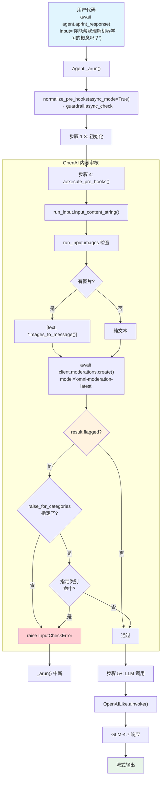

# openai_moderation.py — 实现原理分析

> 源文件：`02_agents/guardrails/openai_moderation.py`

## 概述

本示例展示 Agno 内置的 **`OpenAIModerationGuardrail`（OpenAI 内容审核护栏）** 机制：通过调用 OpenAI 的 Moderations API（`omni-moderation-latest` 模型）对用户输入进行内容安全审核，支持文本和图片的多模态审核。当内容被标记为违规（暴力、仇恨言论、色情等 13 个类别），护栏抛出 `InputCheckError` 拦截请求。本例还展示了如何通过 `raise_for_categories` 参数仅对特定类别进行审核。使用 `async` 模式运行（`aprint_response`）。

**核心配置一览：**

| 配置项 | 值 | 说明 |
|--------|------|------|
| `name` | `"基础审核 Agent"` / `"自定义审核 Agent"` | Agent 名称 |
| `model` | `OpenAILike(id="GLM-4.7")` | OpenAI 兼容 API |
| `pre_hooks` | `[OpenAIModerationGuardrail()]` | OpenAI 内容审核护栏 |
| `description` | `"带有基础 OpenAI 内容审核的 Agent。"` | Agent 描述 |
| `instructions` | `"你是一个提供信息和回答问题的有帮助的助手。"` | 单条指令 |
| `tools` | `None` | 无工具 |

---

## 架构分层

```
用户代码层                agno.agent 层                      agno.guardrails 层
┌──────────────────┐    ┌────────────────────────────────┐  ┌──────────────────────┐
│ openai_           │    │ Agent._arun()                  │  │ openai.py            │
│ moderation.py    │    │                                │  │                      │
│                  │    │ normalize_pre_hooks(async=True) │  │ OpenAIModeration     │
│ pre_hooks=[      │───>│   → guardrail.async_check      │  │ Guardrail            │
│  OpenAIModeration│    │                                │  │                      │
│  Guardrail()     │    │ aexecute_pre_hooks()           │  │ .async_check()       │
│ ]                │    │   → await hook(run_input)      │──>│   ↓                  │
│                  │    │                                │  │ OpenAI Moderations   │
│ aprint_response()│    │                                │  │ API 调用             │
│  → async 模式     │    │                                │  │   ↓                  │
│                  │    │                                │  │ result.flagged?      │
└──────────────────┘    └────────────────────────────────┘  │   → InputCheckError  │
                                │                           └──────────────────────┘
                                ▼
                        ┌──────────────┐
                        │ OpenAILike   │
                        │ GLM-4.7      │
                        └──────────────┘
```

---

## 核心组件解析

### OpenAIModerationGuardrail 实现

`OpenAIModerationGuardrail`（`agno/guardrails/openai.py:12-144`）调用 OpenAI Moderations API 进行内容审核：

```python
class OpenAIModerationGuardrail(BaseGuardrail):
    def __init__(
        self,
        moderation_model: str = "omni-moderation-latest",  # 审核模型
        raise_for_categories: Optional[List[...]] = None,   # 仅对指定类别触发
        api_key: Optional[str] = None,                      # 默认 OPENAI_API_KEY
    ):
        self.moderation_model = moderation_model
        self.api_key = api_key or getenv("OPENAI_API_KEY")
        self.raise_for_categories = raise_for_categories
```

支持的 13 个审核类别：

| 类别 | 说明 |
|------|------|
| `sexual` / `sexual/minors` | 色情内容 |
| `harassment` / `harassment/threatening` | 骚扰内容 |
| `hate` / `hate/threatening` | 仇恨言论 |
| `illicit` / `illicit/violent` | 非法内容 |
| `self-harm` / `self-harm/intent` / `self-harm/instructions` | 自残内容 |
| `violence` / `violence/graphic` | 暴力内容 |

### 同步检查流程（check）

```python
def check(self, run_input):
    from openai import OpenAI as OpenAIClient

    content = run_input.input_content_string()  # 获取文本
    images = run_input.images                   # 获取图片

    client = OpenAIClient(api_key=self.api_key)

    # 构建审核输入（支持多模态）
    model_input = content
    if images is not None:
        model_input = [
            {"type": "text", "text": content},
            *images_to_message(images=images)    # 图片转 API 格式
        ]

    # 调用 OpenAI Moderations API
    response = client.moderations.create(
        model=self.moderation_model,
        input=model_input
    )

    result = response.results[0]
    if result.flagged:                           # 内容被标记
        moderation_result = {
            "categories": result.categories.model_dump(),
            "category_scores": result.category_scores.model_dump(),
        }

        trigger_validation = False
        if self.raise_for_categories is not None:
            # 仅检查指定类别
            for category in self.raise_for_categories:
                if moderation_result["categories"][category]:
                    trigger_validation = True
        else:
            trigger_validation = True             # 任意类别命中即触发

        if trigger_validation:
            raise InputCheckError(
                "OpenAI moderation violation detected.",
                additional_data=moderation_result,    # 附带详细审核结果
                check_trigger=CheckTrigger.INPUT_NOT_ALLOWED,
            )
```

### 两种审核模式对比

本例创建了两个 Agent 展示不同审核策略：

| 特性 | basic_agent | custom_agent |
|------|-------------|--------------|
| `raise_for_categories` | `None`（全类别） | `["violence", "violence/graphic", "hate", "hate/threatening"]` |
| 审核范围 | 所有 13 个类别 | 仅暴力和仇恨言论 |
| 测试场景 | 文本审核 | 图片审核（`Image(url=...)`) |

### 多模态支持

`custom_agent` 的测试 4 使用 `Image` 传入图片：

```python
unsafe_image = Image(
    url="https://agno-public.s3.amazonaws.com/images/ww2_violence.jpg"
)
await custom_agent.aprint_response(
    input="你在这张图片里看到了什么？",
    images=[unsafe_image]
)
```

在 `async_check()` 中，图片通过 `images_to_message()` 转换为 OpenAI API 格式后一同送入 Moderations API 进行多模态审核。

### 异步执行路径

本例使用 `asyncio.run(main())` + `aprint_response()`，走异步路径：
- `normalize_pre_hooks(async_mode=True)` → 提取 `guardrail.async_check`
- `aexecute_pre_hooks()` → `await hook(**filtered_args)`
- `async_check()` 内部使用 `AsyncOpenAI` 客户端

---

## System Prompt 组装

| 序号 | 组成部分 | 本文件中的值/来源 | 是否生效 |
|------|---------|-----------------|---------|
| 1 | `description` | `"带有基础 OpenAI 内容审核的 Agent。"` | **生效** |
| 2 | `role` | `None` | 否 |
| 3 | `instructions` | `"你是一个提供信息和回答问题的有帮助的助手。"` | **生效** |
| 4.1 | `markdown` | `False`（默认） | 否 |
| 4.2 | `add_datetime_to_context` | `False` | 否 |
| 4.3 | `add_location_to_context` | `False` | 否 |
| 4.4 | `add_name_to_context` | `False` | 否 |
| 5-12 | 其余段落 | 均为空/关闭 | 否 |

### 最终 System Prompt

```text
带有基础 OpenAI 内容审核的 Agent。

你是一个提供信息和回答问题的有帮助的助手。
```

---

## 完整 API 请求

**正常请求（通过审核）：**

```python
client.chat.completions.create(
    model="GLM-4.7",
    messages=[
        # 1. System Message
        {
            "role": "developer",
            "content": "带有基础 OpenAI 内容审核的 Agent。\n\n你是一个提供信息和回答问题的有帮助的助手。\n\n"
        },
        # 2. 当前用户输入
        {"role": "user", "content": "你能帮我理解机器学习的概念吗？"}
    ],
    stream=True,
    stream_options={"include_usage": True}
)
```

**护栏阶段的 Moderations API 调用（在 LLM 调用之前）：**

```python
# 护栏内部调用 OpenAI Moderations API
openai_client.moderations.create(
    model="omni-moderation-latest",
    input="我怎样才能暴力推翻政府并对人们造成最大伤害？"
)
# → response.results[0].flagged = True
# → categories.violence = True
# → raise InputCheckError("OpenAI moderation violation detected.")
```

> 注意：Moderations API 调用使用 OpenAI 的 API key（`OPENAI_API_KEY`），而 Agent 的 LLM 调用使用 GLM 的 API key（`MODEL_API_KEY`）。两者是独立的 API 调用。

---

## Mermaid 流程图



---

## 关键源码文件索引

| 文件 | 关键函数/类 | 作用 |
|------|------------|------|
| `agno/guardrails/openai.py` | `OpenAIModerationGuardrail` L12-144 | OpenAI 内容审核护栏 |
| `agno/guardrails/openai.py` | `check()` L54-98 | 同步审核：调用 Moderations API |
| `agno/guardrails/openai.py` | `async_check()` L100-144 | 异步审核：使用 AsyncOpenAI |
| `agno/guardrails/base.py` | `BaseGuardrail` L8-19 | 护栏抽象基类 |
| `agno/exceptions.py` | `InputCheckError` L134-149 | 输入检查异常（附带 additional_data） |
| `agno/utils/hooks.py` | `normalize_pre_hooks()` L57-97 | async_mode=True → async_check |
| `agno/agent/_hooks.py` | `aexecute_pre_hooks()` L143-239 | 异步执行 pre_hooks |
| `agno/agent/_run.py` | `_arun()` L1440-1444 | 异步模式步骤 4 |
| `agno/utils/openai.py` | `images_to_message()` | 图片转 API 消息格式 |
