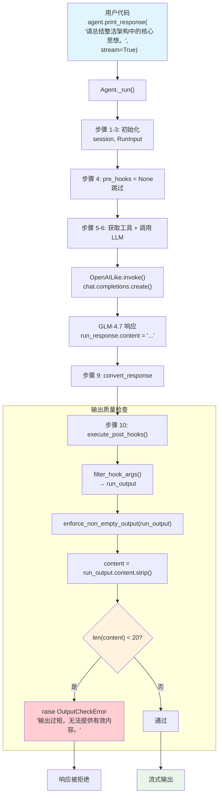

# output_guardrail.py — 实现原理分析

> 源文件：`02_agents/guardrails/output_guardrail.py`

## 概述

本示例展示 Agno 的 **`post_hooks`（输出护栏）** 机制：通过自定义函数 `enforce_non_empty_output` 在 LLM 响应生成**之后**进行输出质量检查。当 LLM 返回的文本长度不足 20 个字符时，抛出 `OutputCheckError` 拒绝该响应。与 `pre_hooks`（输入护栏）不同，`post_hooks` 接收的是 `RunOutput`（LLM 的完整响应），在 `_run()` 的第 10 步执行。本例使用普通函数（非 `BaseGuardrail` 子类）作为 hook。

**核心配置一览：**

| 配置项 | 值 | 说明 |
|--------|------|------|
| `name` | `"输出检查 Agent"` | Agent 名称 |
| `model` | `OpenAILike(id="GLM-4.7")` | OpenAI 兼容 API |
| `post_hooks` | `[enforce_non_empty_output]` | 输出护栏（普通函数） |
| `description` | `None` | 未设置 |
| `instructions` | `None` | 未设置 |
| `tools` | `None` | 无工具 |

---

## 架构分层

```
用户代码层                agno.agent 层
┌──────────────────┐    ┌────────────────────────────────────────┐
│ output_           │    │ Agent._run()                           │
│ guardrail.py     │    │                                        │
│                  │    │ 步骤 1-6: 初始化 + LLM 调用             │
│ post_hooks=[     │    │   → 获得 model_response                │
│  enforce_non_    │    │                                        │
│  empty_output    │───>│ 步骤 9: convert_response               │
│ ]                │    │                                        │
│                  │    │ 步骤 10: execute_post_hooks()           │
│ (普通函数,       │    │   → hook(run_output=RunOutput)          │
│  非 BaseGuardrail)│    │   → OutputCheckError? → 中断           │
└──────────────────┘    └────────────────────────────────────────┘
                                │
                                ▼
                        ┌──────────────┐
                        │ OpenAILike   │
                        │ GLM-4.7      │
                        └──────────────┘
```

---

## 核心组件解析

### enforce_non_empty_output 函数

本例使用普通函数（非 `BaseGuardrail` 子类）作为 `post_hook`：

```python
def enforce_non_empty_output(run_output: RunOutput) -> None:
    """拒绝空或过短的响应。"""
    content = (run_output.content or "").strip()  # 获取 LLM 响应文本
    if len(content) < 20:
        raise OutputCheckError(
            "输出过短，无法提供有效内容。",
            check_trigger=CheckTrigger.OUTPUT_NOT_ALLOWED,
        )
```

关键点：
- 函数签名中只有 `run_output` 参数，`filter_hook_args()` 会自动过滤其他参数
- `run_output.content` 是 LLM 的完整响应文本
- 抛出 `OutputCheckError`（非 `InputCheckError`），触发器为 `OUTPUT_NOT_ALLOWED`

### post_hooks vs pre_hooks 对比

| 特性 | pre_hooks（输入护栏） | post_hooks（输出护栏） |
|------|---------------------|----------------------|
| 执行时机 | `_run()` 步骤 4（LLM 调用前） | `_run()` 步骤 10（LLM 调用后） |
| 接收数据 | `RunInput`（用户输入） | `RunOutput`（LLM 响应） |
| 典型用途 | 拦截危险输入、PII 检测 | 质量检查、格式验证 |
| 异常类型 | `InputCheckError` | `OutputCheckError` |
| 源码位置 | `_run.py:398-416` | `_run.py:540-553` |

### normalize_post_hooks 处理

`normalize_post_hooks()`（`utils/hooks.py:100-140`）对普通函数的处理：

```python
def normalize_post_hooks(hooks, async_mode=False):
    result_hooks = []
    for hook in hooks:
        if isinstance(hook, BaseGuardrail):
            # BaseGuardrail → check / async_check
            ...
        else:
            # 普通函数 → 直接使用（本例命中）
            result_hooks.append(hook)
    return result_hooks
```

普通函数不需要转换，直接保留在 hooks 列表中。

### execute_post_hooks 执行流程

在 `_run()` 第 10 步（`_run.py:540-553`）执行：

```python
# _run.py:540-553
# 9. 转换响应为结构化格式
convert_response_to_structured_format(agent, run_response, run_context=run_context)

# 10. 在输出生成后、返回前执行 post-hooks
if agent.post_hooks is not None:
    post_hook_iterator = execute_post_hooks(
        agent,
        hooks=agent.post_hooks,
        run_output=run_response,      # ← 传入 RunOutput（LLM 响应）
        run_context=run_context,
        session=agent_session,
        ...
    )
    deque(post_hook_iterator, maxlen=0)
```

`execute_post_hooks()`（`_hooks.py:242-333`）与 `execute_pre_hooks()` 结构类似：
1. 使用 `filter_hook_args()` 过滤参数（本例只传 `run_output`）
2. 调用 `hook(**filtered_args)`（即 `enforce_non_empty_output(run_output=...)`）
3. `OutputCheckError` → 直接向上传播

### filter_hook_args 参数过滤

`filter_hook_args()`（`utils/hooks.py:143-165`）根据函数签名自动过滤参数：

```python
def filter_hook_args(hook, all_args):
    sig = inspect.signature(hook)
    accepted_params = set(sig.parameters.keys())
    # enforce_non_empty_output 签名只有 run_output
    # all_args = {run_output, agent, session, user_id, run_context, debug_mode}
    # → 过滤后只传 {run_output: RunOutput(...)}
    filtered_args = {k: v for k, v in all_args.items() if k in accepted_params}
    return filtered_args
```

### OutputCheckError

`OutputCheckError`（`agno/exceptions.py:155-170`）与 `InputCheckError` 结构相同：

```python
class OutputCheckError(Exception):
    def __init__(
        self,
        message: str,
        check_trigger: CheckTrigger = CheckTrigger.OUTPUT_NOT_ALLOWED,
        additional_data: Optional[Dict[str, Any]] = None,
    ):
        self.type = "output_check_error"
        self.error_id = check_trigger.value    # "output_not_allowed"
        self.message = message
        self.additional_data = additional_data
```

---

## System Prompt 组装

| 序号 | 组成部分 | 本文件中的值/来源 | 是否生效 |
|------|---------|-----------------|---------|
| 1 | `description` | `None` | 否 |
| 2 | `role` | `None` | 否 |
| 3 | `instructions` | `None` | 否 |
| 4.1 | `markdown` | `False`（默认） | 否 |
| 4.2 | `add_datetime_to_context` | `False` | 否 |
| 4.3 | `add_location_to_context` | `False` | 否 |
| 4.4 | `add_name_to_context` | `False` | 否 |
| 5-12 | 其余段落 | 均为空/关闭 | 否 |

### 最终 System Prompt

本例未设置任何 prompt 相关参数，`get_system_message()` 返回 `None`，不发送 system message。

---

## 完整 API 请求

```python
client.chat.completions.create(
    model="GLM-4.7",
    messages=[
        # 无 system message
        # 1. 当前用户输入
        {"role": "user", "content": "请总结整洁架构中的核心思想。"}
    ],
    stream=True,
    stream_options={"include_usage": True}
)

# LLM 返回响应后：
# → run_response.content = "整洁架构的核心思想是..."
# → execute_post_hooks()
# → enforce_non_empty_output(run_output)
# → len(content) >= 20 → 通过
# → 返回响应
```

**输出过短被拦截的场景：**

```python
# 假设 LLM 返回 "OK"（2 个字符）
# → enforce_non_empty_output(run_output)
# → len("OK") < 20
# → raise OutputCheckError("输出过短，无法提供有效内容。")
# → 响应被拒绝
```

> 注意：`post_hooks` 在流式模式下（`stream=True`），需要等 LLM 响应**全部接收完毕**后才执行。在 `_run()` 的 stream 版本中（`_run.py:969-972`），post_hooks 在流式输出结束后执行。

---

## Mermaid 流程图



---

## 关键源码文件索引

| 文件 | 关键函数/类 | 作用 |
|------|------------|------|
| `agno/exceptions.py` | `OutputCheckError` L155-170 | 输出检查异常 |
| `agno/exceptions.py` | `CheckTrigger.OUTPUT_NOT_ALLOWED` L127 | 输出不允许触发器 |
| `agno/utils/hooks.py` | `normalize_post_hooks()` L100-140 | 普通函数直接保留 |
| `agno/utils/hooks.py` | `filter_hook_args()` L143-165 | 根据函数签名过滤参数 |
| `agno/agent/_hooks.py` | `execute_post_hooks()` L242-333 | 遍历执行 post_hooks |
| `agno/agent/_run.py` | `_run()` L540-553 | 步骤 10：调用 execute_post_hooks |
| `agno/agent/_run.py` | `_run()` L1218-1219 | normalize_post_hooks 调用 |
| `agno/agent/agent.py` | `post_hooks` L178 | Agent 属性定义 |
| `agno/run/agent.py` | `RunOutput` L581+ | 响应容器，`content` 为 LLM 响应文本 |
