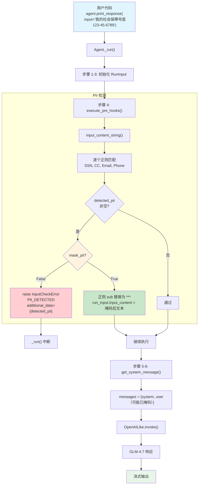

# pii_detection.py — 实现原理分析

> 源文件：`02_agents/guardrails/pii_detection.py`

## 概述

本示例展示 Agno 内置的 **`PIIDetectionGuardrail`（个人身份信息检测护栏）** 机制：通过正则表达式匹配检测用户输入中的 PII（SSN、信用卡号、邮箱、电话号码），支持两种模式：**拦截模式**（默认，抛出 `InputCheckError`）和**掩码模式**（`mask_pii=True`，将 PII 替换为 `*` 后继续处理）。本例通过 8 个测试用例全面验证了各类 PII 检测和掩码功能。

**核心配置一览：**

| 配置项 | 值 | 说明 |
|--------|------|------|
| `name` | `"隐私保护 Agent"` / `"隐私保护 Agent（掩码模式）"` | Agent 名称 |
| `model` | `OpenAILike(id="GLM-4.7")` | OpenAI 兼容 API |
| `pre_hooks` | `[PIIDetectionGuardrail()]` / `[PIIDetectionGuardrail(mask_pii=True)]` | PII 检测护栏 |
| `description` | `"在保护隐私的同时提供客服帮助的 Agent。"` | Agent 描述 |
| `instructions` | `"你是一个有帮助的客服助手..."` | 单条指令 |
| `tools` | `None` | 无工具 |

---

## 架构分层

```
用户代码层                agno.agent 层                      agno.guardrails 层
┌──────────────────┐    ┌────────────────────────────────┐  ┌──────────────────────┐
│ pii_detection.py │    │ Agent._run() / _arun()         │  │ pii.py               │
│                  │    │                                │  │                      │
│ pre_hooks=[      │───>│ normalize_pre_hooks()          │  │ PIIDetection         │
│  PIIDetection    │    │   → guardrail.check            │  │ Guardrail            │
│  Guardrail()     │    │                                │  │                      │
│ ]                │    │ execute_pre_hooks()             │  │ .check(run_input)    │
│                  │    │   → hook(run_input)             │──>│   ↓                  │
│                  │    │                                │  │ 4 种正则匹配         │
│ 拦截模式:        │    │                                │  │   SSN, CC, Email,    │
│   → 抛异常       │    │                                │  │   Phone              │
│ 掩码模式:        │    │                                │  │   ↓                  │
│   → 修改输入     │    │                                │  │ 拦截 or 掩码         │
└──────────────────┘    └────────────────────────────────┘  └──────────────────────┘
                                │
                                ▼
                        ┌──────────────┐
                        │ OpenAILike   │
                        │ GLM-4.7      │
                        └──────────────┘
```

---

## 核心组件解析

### PIIDetectionGuardrail 初始化

`PIIDetectionGuardrail`（`agno/guardrails/pii.py:10-94`）在构造时编译正则表达式：

```python
class PIIDetectionGuardrail(BaseGuardrail):
    def __init__(
        self,
        mask_pii: bool = False,                          # 掩码模式开关
        enable_ssn_check: bool = True,                   # SSN 检测
        enable_credit_card_check: bool = True,            # 信用卡检测
        enable_email_check: bool = True,                  # 邮箱检测
        enable_phone_check: bool = True,                  # 电话检测
        custom_patterns: Optional[Dict[str, Pattern]] = None,  # 自定义模式
    ):
        self.mask_pii = mask_pii
        self.pii_patterns = {}

        if enable_ssn_check:
            self.pii_patterns["SSN"] = re.compile(r"\b\d{3}-\d{2}-\d{4}\b")
        if enable_credit_card_check:
            self.pii_patterns["Credit Card"] = re.compile(
                r"\b\d{4}[\s-]?\d{4}[\s-]?\d{4}[\s-]?\d{4}\b"
            )
        if enable_email_check:
            self.pii_patterns["Email"] = re.compile(
                r"\b[A-Za-z0-9._%+-]+@[A-Za-z0-9.-]+\.[A-Z|a-z]{2,}\b"
            )
        if enable_phone_check:
            self.pii_patterns["Phone"] = re.compile(
                r"\b\d{3}[\s.-]?\d{3}[\s.-]?\d{4}\b"
            )

        if custom_patterns:
            self.pii_patterns.update(custom_patterns)     # 合并自定义模式
```

### 正则匹配规则

| PII 类型 | 正则表达式 | 匹配示例 |
|----------|-----------|---------|
| SSN | `\b\d{3}-\d{2}-\d{4}\b` | `123-45-6789` |
| Credit Card | `\b\d{4}[\s-]?\d{4}[\s-]?\d{4}[\s-]?\d{4}\b` | `4532 1234 5678 9012` / `4532123456789012` |
| Email | `\b[A-Za-z0-9._%+-]+@[A-Za-z0-9.-]+\.[A-Z\|a-z]{2,}\b` | `john@example.com` |
| Phone | `\b\d{3}[\s.-]?\d{3}[\s.-]?\d{4}\b` | `555-123-4567` / `555.987.6543` |

### check() 的两种模式

```python
def check(self, run_input):
    content = run_input.input_content_string()
    detected_pii = []

    # 1. 逐个正则匹配
    for pii_type, pattern in self.pii_patterns.items():
        if pattern.search(content):
            detected_pii.append(pii_type)

    if detected_pii:
        if self.mask_pii:
            # 掩码模式：用 * 替换匹配内容
            for pii_type in detected_pii:
                def mask_match(match):
                    return "*" * len(match.group(0))       # 等长 * 替换
                content = self.pii_patterns[pii_type].sub(mask_match, content)
            run_input.input_content = content               # ← 修改原始输入
            return                                          # 继续执行，不抛异常

        else:
            # 拦截模式：抛出异常
            raise InputCheckError(
                "Potential PII detected in input",
                additional_data={"detected_pii": detected_pii},  # 附带检测到的类型
                check_trigger=CheckTrigger.PII_DETECTED,
            )
```

**关键区别：**

| 模式 | `mask_pii` | 行为 | 对 run_input 的影响 |
|------|-----------|------|-------------------|
| 拦截 | `False` | 抛出 `InputCheckError` | 无（请求中断） |
| 掩码 | `True` | 替换 PII 为 `*`，继续执行 | 修改 `input_content` |

### 掩码模式的输入修改

掩码模式的核心在于**直接修改 `run_input.input_content`**：

```python
# 原始输入：
"你好，我的社会保障号是 123-45-6789。能帮我处理账户问题吗？"

# 掩码后：
"你好，我的社会保障号是 ***********。能帮我处理账户问题吗？"
```

由于 `execute_pre_hooks()` 中 `run_input` 是引用传递，修改后的内容会传递给后续的 LLM 调用。在 `execute_pre_hooks()` 结束时（`_hooks.py:140`），还会更新 `run_response.input = run_input`。

### 测试用例覆盖

| 测试 | 输入 PII | 类型 | 模式 | 预期结果 |
|------|---------|------|------|---------|
| 1 | 无 | - | 拦截 | 通过 |
| 2 | `123-45-6789` | SSN | 拦截 | InputCheckError |
| 3 | `4532 1234 5678 9012` | Credit Card | 拦截 | InputCheckError |
| 4 | `john.doe@example.com` | Email | 拦截 | InputCheckError |
| 5 | `555-123-4567` | Phone | 拦截 | InputCheckError |
| 6 | Email + Phone | 混合 | 拦截 | InputCheckError |
| 7 | `4532123456789012` | Credit Card（无空格） | 拦截 | InputCheckError |
| 8 | `123-45-6789` | SSN | **掩码** | 通过（`***********`） |

---

## System Prompt 组装

| 序号 | 组成部分 | 本文件中的值/来源 | 是否生效 |
|------|---------|-----------------|---------|
| 1 | `description` | `"在保护隐私的同时提供客服帮助的 Agent。"` | **生效** |
| 2 | `role` | `None` | 否 |
| 3 | `instructions` | `"你是一个有帮助的客服助手。请始终保护用户隐私并妥善处理敏感信息。"` | **生效** |
| 4.1 | `markdown` | `False`（默认） | 否 |
| 4.2 | `add_datetime_to_context` | `False` | 否 |
| 4.3 | `add_location_to_context` | `False` | 否 |
| 4.4 | `add_name_to_context` | `False` | 否 |
| 5-12 | 其余段落 | 均为空/关闭 | 否 |

### 最终 System Prompt

```text
在保护隐私的同时提供客服帮助的 Agent。

你是一个有帮助的客服助手。请始终保护用户隐私并妥善处理敏感信息。
```

---

## 完整 API 请求

**拦截模式（PII 被检测，请求中断）：**

```python
# 护栏检测到 SSN "123-45-6789"
# → raise InputCheckError(
#     "Potential PII detected in input",
#     additional_data={"detected_pii": ["SSN"]},
#     check_trigger=CheckTrigger.PII_DETECTED
#   )
# → _run() 中断，不调用 LLM
```

**掩码模式（PII 被替换后继续）：**

```python
client.chat.completions.create(
    model="GLM-4.7",
    messages=[
        # 1. System Message
        {
            "role": "developer",
            "content": "在保护隐私的同时提供客服帮助的 Agent。\n\n你是一个有帮助的客服助手。请始终保护用户隐私并妥善处理敏感信息。\n\n"
        },
        # 2. 当前用户输入（PII 已被掩码）
        {
            "role": "user",
            "content": "你好，我的社会保障号是 ***********。能帮我处理账户问题吗？"
        }
    ],
    stream=True,
    stream_options={"include_usage": True}
)
```

> 掩码模式下，LLM 收到的是已脱敏的输入，不会接触到原始 PII 数据。

---

## Mermaid 流程图



---

## 关键源码文件索引

| 文件 | 关键函数/类 | 作用 |
|------|------------|------|
| `agno/guardrails/pii.py` | `PIIDetectionGuardrail` L10-94 | PII 检测护栏，4 种默认正则 |
| `agno/guardrails/pii.py` | `check()` L48-70 | 同步检测：拦截或掩码 |
| `agno/guardrails/pii.py` | `async_check()` L72-94 | 异步检测（逻辑相同） |
| `agno/guardrails/base.py` | `BaseGuardrail` L8-19 | 护栏抽象基类 |
| `agno/exceptions.py` | `CheckTrigger.PII_DETECTED` L131 | PII 检测专用触发器 |
| `agno/exceptions.py` | `InputCheckError` L134-149 | 输入检查异常（附带 additional_data） |
| `agno/agent/_hooks.py` | `execute_pre_hooks()` L42-141 | 遍历执行 pre_hooks，L140 更新 run_response.input |
| `agno/run/agent.py` | `RunInput` L29-48 | 输入容器，`input_content` 可被掩码模式修改 |
